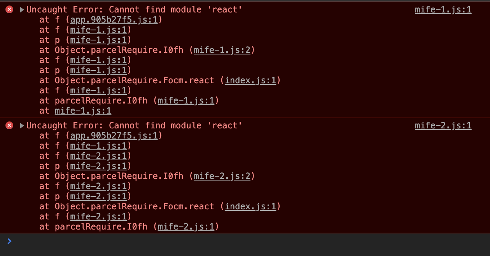

Microfrontends sind mittlerweile ein fest etabliertes Muster, um größere Frontend Applikationen in kleinere Teile aufzuspalten. Im Gegensatz zu klassischen Komponenten geht es bei Microfrontends nicht in erster Linie um die technische Basis, sondern eher um eine Zerteilung auf Feature-Ebene. Sie sind daher erst auf einer höheren Ebene anzustoßen.

(Anmerkung: Die Feature-Ebene ist nicht unbedingt die Domain-Ebene. Im Prinzip geht hier um Business Capabilities - wie genau das ausgelebt wird ist dem jeweiligen Team überlassen. Wichtig ist nur, dass es nicht um technische Komponenten geht, sondern diese eine Ebene höher angesiedelt sind. Dies kann natürlich eine fachliche Domäne sein - muss aber keineswegs so gelebt werden.)

_Vorab_: Den kompletten Beispielcode könnt ihr auf GitHub erhalten. Ich habe ihn dort unter [FlorianRappl/mife-tutorial](https://github.com/FlorianRappl/mife-tutorial) abgelegt. Nutzt die Issues gerne für Fragen, Anmerkungen oder bei Problemen!

## Entscheidungsmerkmale

Prinzipiell gibt es beim Bau von Microfrontends mehrere Varianten: Die Extreme sind sicherlich eine rein serverseitiger und eine rein clientseitige Zusammenstellung der eigentlichen Seite bzw. Applikation. Dank isomorphen Rendering kann man in React beide Welten bedienen.

Eine weitere wichtige Entscheidung ist die Wahl zwischen einem gemeinsamen Layout (gegeben durch eine sog. "Application Shell") und einem leeren Start. Daneben kann man sich noch für oder gegen gemeinsam genutzte Libraries entscheiden.

Im Folgenden bauen wir ein kleines Microfrontend auf, das

- bis auf React und React Router keine gemeinsamen Bibliotheken nutzt und
- kein gemeinsames Layout ausrollt.

## Applikationsgestaltung

Obwohl wir in diesem Tutorial im Prinzip ohne Application Shell auskommen, muss eine kleine Runtime erstellt werden, welche die verschiedenen Microfrontends laden muss. Als Nebenbedingung sollte diese Runtime auch isomorphes Rendering unterstützen, so dass wir sowohl den clientseitigen Modus als auch das serverseitige Vorab-Rendering unterstützen können.

Zunächst müssen wir eine Funktion bauen um die einzelnen Microfrontends zu laden. Diese Funktion brauchen wir unabhängig von möglichen serverseitigen Rendering. Der einzige Unterschied ist, dass beim Rendering durch den Server die verschiedenen Module möglicherweise bereits vorhanden sind.

```js
function attachMicrofrontendFromUrl(url) {
  return new Promise(resolve => {
    const s = document.createElement("script");
    s.src = url;
    s.onerror = err => {
      console.error(err);
      resolve({
        url,
        Microfrontend: defaultMicrofrontend
      });
    };
    s.onload = () => {
      resolve({
        url,
        Microfrontend: s.App || defaultMicrofrontend
      });
    };
    document.body.appendChild(s);
  });
}

async function loadMicrofrontendsFromServer() {
  const defaultMicrofrontend = () => null;
  const res = await fetch("./microfrontends.json");
  const urls = await res.json();
  return await Promise.all(urls.map(attachMicrofrontendFromUrl));
}

function loadMicrofrontends() {
  return Promise.resolve(
    window.microfrontends || loadMicrofrontendsFromServer()
  );
}
```

Die Adresse im Code oben ist willkürlich. In diesem Tutorial werden wir eine statische Map durch eine JSON Datei verwenden. In der Realität wäre bspw. ein dedizierter Service geschickter.

Zur besseren Lesbarkeit wurde hier `await` / `async` verwendet. Eine kurze Erklärung findet Ihr [im Blog Post von Florian Strauß](https://orlyapps.de/blog/web/asyncawait-asynchrone-javascript-programmierung).

Der eigentliche React Code in der Application Shell könnte in eine Komponente `AppShell` gepackt werden.

```jsx
import * as React from "react";
import { BrowserRouter } from "react-router-dom";

const AppShell = ({ microfrontends }) => {
  return (
    <BrowserRouter>
      {microfrontends.map(({ url, Microfrontend }) => (
        <Microfrontend key={url} />
      ))}
    </BrowserRouter>
  );
};
```

Als übergeordneten Kontext verwenden wir den `BrowserRouter` von `react-router-dom`. Dadurch erhalten wir sehr einfach eine Möglichkeit um die Microfrontends selektiv zu aktivieren oder deaktivieren. Ob und wie der Kontext genutzt wird entscheidet jedes Microfrontend selbst.

Unsere Runtime übernimmt auch das Rendering. Der Code hierfür ist einfach:

```jsx
import * as React from "react";
import { hydrate } from "react-dom";

loadMicrofrontends().then(microfrontends => {
  const app = document.querySelector("#app");
  hydrate(<AppShell microfrontends={microfrontends} />, app);
});
```

Anstelle von `render` nutzen wir `hydrate` um unseren Code auch effizient mit serverseitigem Rendering (SSR) ausführen zu können. Auch ohne ausgeführtes SSR würde dieser Code halbwegs effizient ablaufen.

Während bei `render` der existierende DOM Baum verworfen wird, schaut sich `hydrate` zunächst diesen an. Anschließend werden nur die Knoten ersetzt die sich tatsächlich vom vorgefunden Baum unterscheiden. Im Idealfall muss `hydrate` zunächst keine Änderungen am DOM Baum vornehmen. Bei beiden Varianten wird React "aktiviert", d. h. anschließende Änderungen reaktiv von React mit minimalisten DOM Änderungen ausgeführt. Im Langzeitverhalten sind daher beide Varianten identisch.

## Das erste Microfrontend

Nachdem unsere kleine Runtime steht brauchen wir jetzt noch ein paar Microfrontends um die bislang leere Seite mit Leben zu füllen.

Das folgende Microfrontend setzt 2 Routen - eine für die Homepage und eine für eine Profilseite. Zusätzlich werden hier zwei Links eingesteuert.

```jsx
import * as React from "react";
import { Route, Link } from "react-router-dom";

export const Home = () => <div>You are on the home page!</div>;

export const Profile = () => <div>You are on your profile page!</div>;

if (document.currentScript) {
  document.currentScript.App = () => (
    <>
      <Link className="menu-link" to="/">
        Home
      </Link>
      <Link className="menu-link" to="/profile">
        Profile
      </Link>
      <Route path="/" exact component={Home} />
      <Route path="/profile" exact component={Profile} />
    </>
  );
}
```

Der kritische Aspekt ist hier sicherlich unsere Konvention dem `currentScript` (falls vorhanden) ein Feld `App` hinzuzufügen. Dieses Feld wird mit der oben `Microfrontend` genannten Komponente gefüllt. Die Komponente bestimmt den Lifecycle für unser Microfrontend.

Beispielsweise könnten wir beim Laden des Microfrontends auch noch weitere Daten holen.

```jsx
import * as React from "react";
import { Route, Link } from "react-router-dom";

export const OnlineUsers = ({ users }) => (
  <div>
    <b>The online users display is there on every page ...</b>
    <ul>
      {users.map(user => (
        <li key={user.id}>
          {user.name.first} {user.name.last}
        </li>
      ))}
    </ul>
  </div>
);

if (document.currentScript) {
  document.currentScript.App = () => {
    const [users, setUsers] = React.useState([]);
    React.useEffect(() => {
      const loadUsers = () => {
        fetch("https://randomuser.me/api?results=5")
          .then(res => res.json())
          .then(res => setUsers(res.results));
      };
      loadUsers();
      // reload every 20 seconds
      const id = setInterval(loadUsers, 20 * 1000);
      return () => clearInterval(id);
    }, []);
    return (
      <>
        <Route path="/" render={() => <OnlineUsers users={users} />} />
      </>
    );
  };
}
```

Im oben beschriebenen Beispiel registrieren wir eine Komponente `OnlineUsers` für jede Seite. Entscheidet ist hier in der Verwendung von `Route`, dass wir das prop `exact` weggelassen haben. Die Übereinstimmung trifft in diesem Fall auf alle Seiten die mit `/` beginnen zu.

## Ein erster Laufversuch

Unser Code ist startklar, doch wie kriegen wir das gesamte Konstrukt jetzt lauffähig?

Zunächst mal sollten wir die Application Shell bauen. Ein gutes Tool hierfür ist [Parcel](https://parceljs.org). Parcel ist im Prinzip ein Bundler wie Webpack. Der größte Unterschied liegt im Konfigurationsaufwand: Während Webpack auf viele kleine Plugins mit entsprechenden Integrationsaufwand setzt, steht bei Parcel eine Konfigurationslose Out-of-the-Box Experience im Vordergrund.

Die Installation der Abhängigkeiten könnte daher folgendermaßen aussehen:

```sh
npm i react react-dom react-router react-router-dom --save
npm i parcel-bundler --save-dev
```

Eine mögliche Ordnerstruktur für unser Projekt sieht in diesem Fall so aus:

```plain
+ dist
| + index.html
| + app.js
| + microfrontends.json
| + mife-1.js
| + mife-2.js
| + ...
+ packages
| + app-shell
| + mife-1
| + mife-2
| + ...
+ tools
| + build-all.js
```

Die Inhalte von `dist` werden über das Skript `build-all.js` erzeugt. Hierfür macht `build-all.js` nichts anderes als über die einzelnen Pakete (Ordner: `packages`) zu iterieren und diese dann mit `npm run build` zu bauen.

```js
const { existsSync, readdirSync, rmdirSync, writeFileSync } = require("fs");
const { resolve } = require("path");
const { execSync } = require("child_process");

const root = resolve(__dirname, "..");
const packages = resolve(root, "packages");
const dist = resolve(root, "dist");
const manifest = resolve(dist, "microfrontends.json");
const names = readdirSync(packages);
const urls = names.filter(n => n.startsWith("mife-")).map(n => `./${n}.js`);

if (existsSync(dist)) {
  rmdirSync(dist, { recursive: true });
}

names.forEach(name => {
  const cwd = resolve(packages, name);
  execSync("npm run build", { cwd });
});

writeFileSync(manifest, JSON.stringify(urls), "utf8");
```

Vor der Ausführung von `npm run build` löschen wir den `dist` Ordner. **Vorsicht**: Die `recursive` Option bei `rmdir` gibt es erst seit Node.js 12.

Für unsere Application Shell kann `npm run build` so einfach sein wie der folgende Aufruf:

```sh
parcel build src/index.html --out-dir ../../dist
```

Bei den verschiedenen Microfrontends müssen wir noch ein bisschen Arbeit hinzufügen.

Der eigentliche Build Befehl sieht auch hier nicht anders:

```sh
parcel build src/index.js --out-dir ../../dist --out-file mife-1.js
```

Das Problem an diesem Aufruf ist, dass die gemeinsamen Abhängigkeiten (`react`, `react-dom`, `react-router`, `react-router-dom`) alle mitgebündelt werden. Dies wollen wir aus Effizienzgründen jedoch vermeiden.

Die Lösung lautet `parcel-plugin-externals`. Hierüber lassen sich sehr einfach externe Abhängigkeiten definieren.

```sh
npm i parcel-plugin-externals --save-dev
```

Zur korrekten Verwendung des Plugins müssen wir die `dependencies` in `peerDependencies` verwandeln. Anschließend verwenden wir uns Build Skript:

```sh
node tools/build-all.js
```

Und starten einen kleinen Server im Verzeichnis `dist`. Dies kann z. B. durch `npx http-server` erledigt werden.

Allerdings bleibt der Bildschirm weiß. Eine nähere Inspektion in der Konsole des Browsers liefert folgendes Ergebnis:



Irgendwie müssen wir die gemeinsamen Abhängigkeiten noch bereitstellen. Eigentlich hat Parcel bereits so einen globalen Mechanismus, allerdings funktioniert dieser in diesem Fall nicht so richtig.

Die Lösung ist ein einfacher Hack um die globale Auflösung auf die lokale Umzustellen.

In der Application Shell können wir einfach folgendes Snippet einfügen:

```js
setTimeout(() => {
  window.parcelRequire = require;
}, 0);
```

Dadurch wird nach der Zuweisung der zunächst leeren `parcelRequire` die lokale `require` zugewiesen. Ohne `setTimeout` wärs anders rum: Hier würde die lokale `require` durch eine leere Version ersetzt werden.

Funktioniert!

## Einsatz mit Server-Side Rendering

Soweit so gut. Jetzt wollen wir unseren recht einfachen Ansatz noch durch serverseitiges Rendering ordentlich aufpimpen.

Unser Ziel ist auch bei nicht aktivierten JavaScript bereits den gesamten Inhalt auszuliefern. Idealerweise bleiben hierfür die verschiedenen Microfrontends unangetastet. An der Application Shell sind einige Änderungen notwendig:

- Die Microfrontends werden außerhalb der Applikation bereits vorgeladen
- Anstelle des `BrowserRouter`s müssen wir den `StaticRouter` verwenden
- Die Verwendung von `react-dom` ist nicht direkt möglich
- Wir müssen über `react-dom/server` die `renderToString` Funktion ausführen

Eine entsprechende Refaktorisierung scheint daher sinnvoll...

Schauen wir zunächst auf unsere Verzeichnisstruktur. Eine kleine Änderung bei den Paketen verdeutlicht sofort unsere neue Richtung:

```plain
+ dist
| + static
| + ...
| + index.js
+ packages
| + app-client
| + app-common
| + app-server
| + ...
+ ...
```

Die Applikation besteht nun aus einem Client und einem Server Teil. Die gemeinsame Logik platzieren wir in einem neuen Common Modul.

Alle statischen Resourcen werden nun in `dist/static` ausgegben. Der Server wird direkt in `dist` geschrieben.

Auch für den Bau des Node.js mit Express basierten Servers können wir Parcel verwenden. Hierfür müssen wir nur den Kommandozeilenparameter `--target node` angeben. Zusätzlich sollten wir die Module über `--bundle-node-modules` ins selbe Paket stecken.

```sh
parcel build src/index.js --bundle-node-modules --target node --out-dir ../../dist
```

Der dazu gehörige Code ist ziemlich straight forward. Um die einzelnen Microfrontends auszulesen verwenden wir einfach folgendes Schnippsel:

```js
const Module = require("module");
const { readFileSync } = require("fs");
const { resolve } = require("path");

const nodeRequire = Module.prototype.require;
global.parcelRequire = require;

const www = resolve(__dirname, "static");
const microfrontendUrls = JSON.parse(
  readFileSync(resolve(www, "microfrontends.json"), "utf8")
);

const microfrontends = microfrontendUrls.map(url => ({
  url,
  Microfrontend: nodeRequire(resolve(www, url)).default
}));
```

Die zwei wichtigsten Punkte hier sind:

1. Da das Node.js `require` durch die modulinterne Variante von Parcel ersetzt wird, müssen wir uns das "Original" merken; `nodeRequire` erfüllt hier seinen Zweck.
2. Unsere Microfrontends brauchen wieder die globale Variante von Parcel. Über `global.parcelRequire = require` stellen wir die entsprechend bereit.

Das Senden des HTML Inhalts d. h. das eigentliche serverseitige Rendering passiert in der `sendIndex` Funktion:

```js
const { readFileSync } = require("fs");
const { resolve } = require("path");
const { createElement } = require("react");
const { renderToString } = require("react-dom/server");
const { StaticRouter } = require("react-router-dom");
const { AppShell } = require("../../app-common");

const indexHtml = readFileSync(resolve(www, "index.html"), "utf8");

async function sendIndex(req, res) {
  const shell = createElement(AppShell, {
    microfrontends
  });
  const app = createElement(
    StaticRouter,
    {
      location: req.path
    },
    shell
  );
  const body = renderToString(app);
  const script = `<script>window.microfrontends = ${JSON.stringify(
    microfrontendUrls
  )};</script>`;
  const content = indexHtml
    .replace('<div id="app"></div>', `<div id="app">${body}</div>`)
    .replace('<noscript id="data"></noscript>', script);
  res.send(content);
}
```

Die magischen Ersetzungen sorgen dafür, dass wir unser ursprüngliches HTML Dokument weder modifizieren noch duplizieren müssen. Sweet! Selbstverständlich könnte der oben gezeigte Code soweit ausgebaut werden um auch Aktualisierungen des Frontends ohne einen Neustart zu ermöglichen.

Durch die Verwendung des `StaticRouter`s mit der `location` können wir bereits zur serverseitigen Renderzeit die richtigen Komponenten ausgeben.

Der Rest vom kleinen Node.js Server sorgt nur dafür, dass alle Resourcen entsprechend transportiert werden.

```js
const express = require(express);
const app = express();

const port = process.env.PORT || 1234;

app.get("/", sendIndex);

// resolve any static content, such as /dynamic.js
app.get(
  "*",
  express.static(www, {
    fallthrough: true
  })
);

// fall back to the index (SPA mode) in any other case
app.get("*", sendIndex);

app.listen(port, () => {
  console.log(`Server running at port ${port}.`);
});
```

Und schon haben wir ohne großen Aufwand serverseitges Rendering aktiviert!

## Fazit

Microfrontends und React - das passt. Das Komponentenmodell von React ist ideal geeignet um Microfrontends sehr einfach zu ermöglichen. Das gezeigte Beispiel hat uns bereits nah an eine mögliche - bereits produktiv einsetzbare - Implementierung gebracht. Den Code findet ihr auf [GitHub](https://github.com/FlorianRappl/mife-tutorial).

Ein Ausbau dieses Modells ist in vielen Aspekten möglich. Schwachstellen u. a. beim Thema Debugging, verteilte Entwicklung, etc. können durch verbessertes Tooling und einen verbesserten Schnittstellenbau ausgemerzt werden.

Eine Implementierung mit fortgeschrittenen Reifegrad existiert mit dem Open-Source Framework [Piral](https://github.com/smapiot/piral). Hier stehen u. a. Runtime Isolierung und bequemes Tooling im Vordergrund. Piral bietet mit `piral-core` bzw. `piral-base` auch Bibliotheken an, die den Aufbau eines komplett eigenen Ansatzes ermöglichen.
