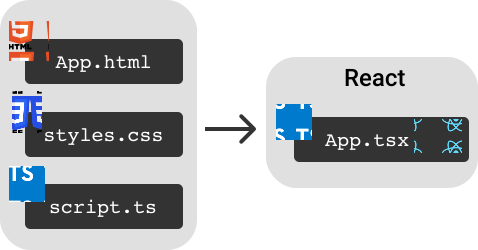

## Einführung

In diesem Tutorial werden wir anhand praktischer Beispiele die Essenz der JavaScript-Bibliothek **React.js** verstehen und lernen, wie man mit **React** Web-Applikationen schreibt.

Gespickt mit TypeScript und moderner JavaScript-Syntax ergibt sich sehr eleganter Code.

Dieses Tutorial setzt keine Vorkenntnisse in React voraus und richtet sich an alle Menschen, die es lernen und gut verstehen möchten. Ein Grundwissen in HTML, CSS und JavaScript sollte man aber mitbringen.

Wir werden eine Web-App programmieren, die Bild-Informationen von einem Server erfragt und diese dann anzeigt.

Diese Einführung ist für Anfänger gedacht, die gerade mit React beginnen. Das Beispiel orientiert sich an den ersten Aufgaben unserer Workshop-Inhalte der [React Intensiv Schulung](https://workshops.de/seminare-schulungen-kurse/react-typescript).

Unsere Didaktik behandelt dabei die Motivation, die Theorie und dann den Praxis-Teil. Ihr könnt hierbei alle Aufgaben selber programmieren und über unseren Workshops.DE Classroom Hilfestellungen und Musterlösungen für die Aufgaben erhalten.


## Inhaltsverzeichnis: Was werden wir lernen?

- [Einführung](#einführung)
- [Inhaltsverzeichnis: Was werden wir lernen?](#inhaltsverzeichnis-was-werden-wir-lernen)
- [Warum nicht ganz ohne Bibliotheken (Libraries) und Frameworks?](#warum-nicht-ganz-ohne-bibliotheken-libraries-und-frameworks)
- [Was ist und kann React?](#was-ist-und-kann-react)
- [Was ist React?](#was-ist-react)
  - [React macht es anders](#react-macht-es-anders)
  - [React ist schnell - dank des virtuellen DOM](#react-ist-schnell---dank-des-virtuellen-dom)
  - [React ist nicht nur im Web zu Hause](#react-ist-nicht-nur-im-web-zu-hause)
- [Anbindung von React](#anbindung-von-react)
  - [Wie kommt React ins Spiel?](#wie-kommt-react-ins-spiel)
- [Das Herzstück von React: Die Komponente](#das-herzstück-von-react-die-komponente)
  - [React-Elemente und JSX](#react-elemente-und-jsx)
  - [React Komponente](#react-komponente)
- [Vorteile von JSX](#vorteile-von-jsx)
  - [JavaScript Ausdrücke in JSX](#javascript-ausdrücke-in-jsx)
  - [Bedingtes Rendern](#bedingtes-rendern)
- [React Props](#react-props)
  - [Props in React Komponenten](#props-in-react-komponenten)
  - [Props in React-Elementen](#props-in-react-elementen)
  - [Die spezielle `children` prop](#die-spezielle-children-prop)
- [Inline Styles in React](#inline-styles-in-react)
  - [Inline styles](#inline-styles)
- [TypeScript: Komponenten sicher machen](#typescript-komponenten-sicher-machen)
  - [Was ist TypeScript?](#was-ist-typescript)
  - [TypeScript anwenden](#typescript-anwenden)
- [Interaktion mit `onClick` Event-Handlern](#interaktion-mit-onclick-event-handlern)
- [Organisation eines React Projekts](#organisation-eines-react-projekts)
- [API Requests](#api-requests)
  - [Promises](#promises)
  - [`fetchImageData` dem `onClick` Event-Handler übergeben](#fetchimagedata-dem-onclick-event-handler-übergeben)
  - [User Interface der Bild-Anzeige](#user-interface-der-bild-anzeige)
    - [Daten nicht "reactive"](#daten-nicht-reactive)
- [React Hooks](#react-hooks)
  - [Reactivity](#reactivity)
  - [`useState` Hook](#usestate-hook)
    - [Lokale Variable durch State ersetzen](#lokale-variable-durch-state-ersetzen)
  - [Zwei zusätzliche States](#zwei-zusätzliche-states)
    - [Lade Status](#lade-status)
    - [Fehler im try-catch Block abfangen und anzeigen](#fehler-im-try-catch-block-abfangen-und-anzeigen)
- [Fazit](#fazit)
  - [Vergleich mit anderen FrontEnd Technologien](#vergleich-mit-anderen-frontend-technologien)
  - [Die nächsten Schritte](#die-nächsten-schritte)
  - [Fehler & Typos](#fehler--typos)
  - [Danksagung](#danksagung)


<hr>
<div class="workshop-hint text-center">
 <div class="h3">React noch schneller lernen?</div>
 <div class="row mb-2">
   <div class="col-xs-12 col-md-6">
     <p> Wir bieten auch <a target="_blank" href="https://workshops.de/seminare-schulungen-kurse/react-typescript?utm_source=reactjs_de&utm_campaign=tutorial&utm_medium=link&utm_content=text-article-top">React und TypeScript Schulungen</a>        an um dich möglichst effektiv in das Thema React zu begleiten. Im Kurs kannst Du die Fragen stellen, die Du nur
       schlecht googlen kannst, z.B. “Besserer Weg, um meine Applikation zu strukturieren”. Wir können sie Dir beantworten.
     </p>
     <p class="text-center">
       <a target="_blank" href="https://workshops.de/seminare-schulungen-kurse/react-typescript?utm_source=reactjs_de&utm_campaign=tutorial&utm_medium=button&utm_content=text-article-top">
         <button class="btn btn-danger">Zur React Intensiv Schulung</button>
       </a>
     </p>
   </div>
   <div class="col-xs-12 col-md-6">
     
   </div>
 </div>
</div>
<hr>

## Warum nicht ganz ohne Bibliotheken (Libraries) und Frameworks?

Man kann natürlich eine Web-Applikation ganz rein mit HTML, CSS und JavaScript bauen.
Ohne eine JavaScript-Bibliothek, wie zum Beispiel **React** ist es aber viel schwieriger Web-Applikationen zu bauen, die in wirklich jedem Browser laufen, dabei gut aussehen und auch noch performant sind.

JavaScript-Frameworks bringen daneben auch noch eingebaute Mechanismen für die Verwaltung komplexer Business-Logik oder komplexe Updates des User Interfaces (UI) mit. Bei **React** kann man bei Bedarf weitere Bibliotheken für diese komplexeren Aufgaben Schritt-für-Schritt hinzufügen.

Komplexe Vorgänge ganz ohne Bibliotheken oder Frameworks umzusetzen, führt zu schwer wartbarem Code und ist viel fehleranfälliger, da für fast jedes Problem eigene Lösungen geschaffen werden müssen. Gute Lösungen für Probleme, die es bei jeder Web-App gibt, sind durch die Unterstützung großer Communities an Entwicklern, die sich rund um verschiedene Frameworks versammeln, entstanden. Damit kommt man viel schneller dahin auch als Anfänger robuste und performante Web-Apps zu programmieren.

## Was ist und kann React?

**React.js** (oder kurz **React**) ist im Gegensatz zu Frontend **Frameworks**, die alles gebündelt mitbringen, eine schlanke **Bibliothek**. Ich möchte dir nun ein wenig über die Besonderheit von React erzählen.

Wenn du direkt zum praktischen Teil des Tutorials springen möchtest, überspringe dieses Kapitel und gehe direkt zu [Anbindung von React](#anbindung-von-react).

## Was ist React?

Um das User-Interface (UI) einer Web-Applikation zu programmieren, nutzt man die folgenden drei Technologien:

- **HTML**: Gibt die Struktur der UI vor.
- **CSS**: Fügt den HTML-Elementen Style (Farben, Abstände etc.) hinzu
- **JavaScript**: Reagiert auf die User-Interaktion mit HTML-Elementen und löst weitere Prozesse aus.

### React macht es anders

Das Zusammenwirken von JavaScript und HTML wird in anderen Bibliotheken durch Querverbindungen zwischen HTML-Dateien und JavaScript Dateien verwirklicht.

Mit React erstellt man logische Einheiten aus einem Guss - alles direkt in einer JavaScript Datei - ganz ohne HTML-Dateien (auch Templates genannt).

Beim Bauen der Web-App (sprich: Während des Build-Prozesses) werden aus dem React Code letztendlich auch HTML-Elemente generiert, da der Browser diese erwartet. Als React-Entwickler:in profitiert man aber von der gewonnenen Simplizität. Was für Vorteile das genau hat, sehen wir gleich.

### React ist schnell - dank des virtuellen DOM

Damit React performant unsere Komponenten im Browser darstellen kann, nutzt React unter der Haube einen sogenannten **Reconciliation Algorithmus**. Er optimiert das Rendern, also die grafische Anzeige der Web-App im Browser und damit die Geschwindigkeit der Web-App.

Beim Rendern werden unsere Komponenten in das sogenannte **Domain Object Model** (**DOM**) übersetzt - eine baum-artige Struktur aller HTML-Elemente der Web-App. Jede Änderung des DOM sorgt dafür, dass der Browser ein Teil der CSS-Styles sowie die Anordnung der HTML-Elemente neu berechnen muss. Und das muss dann noch in die einzelnen Pixel-Werte umgewandelt werden. (Neben dem DOM gibt es auch einen CSSOM für Styles, die React nicht optimiert. [Hier](https://developers.google.com/web/fundamentals/performance/critical-rendering-path/render-tree-construction) kannst du mehr über den gesamten Zyklus des Renderns lesen).

All diese Berechnungen kosten Zeit. Da jede Änderung des DOM diese teuren Berechnungen in Gang setzt, möchte man die Anzahl der DOM Manipulationen so gering wie möglich halten.

**Die Idee von React**: Wenn sich bloß ein bestimmter Ausschnitt des User-Interfaces im Vergleich zum aktuell sichtbaren User Interface ändern soll, sollte auch bloß dieser entsprechende Teil neu gerendert werden.

**Wie macht das React?**: Mit der von Browsern bereitgestellten Web-API greift React auf das aktuelle DOM zu und erstellt daraus ein **virtuelles DOM** - eine im Browser-Zwischenspeicher angelegte Repräsentation des User Interfaces. Soll es zu einer Änderung kommen, vergleicht React den aktuellen Zustand mit dem gewünschten im Zwischenspeicher bevor das tatsächliche DOM geändert wird. Dieser Vergleich ist perfomance-technisch günstig. React beauftragt den Browser nach dem Vergleich bloß die Bereiche der DOM nochmals zu rendern, die von der Änderung betroffen sind.

> **Randnotiz**:
>
> - [Svelte](https://svelte.dev/) ist eine neuere Technologie, die die Nutzung eines **virtuellen DOMs** kritisiert. Svelte ist sehr stark von React inspiriert, geht aber einen anderen, interessanten Weg. React als Grundlage für Svelte zu lernen, ist meiner Meinung nach auch eine sehr gute Idee.

### React ist nicht nur im Web zu Hause

Durch die **virtuelle DOM** ist React Platform-unabhängig.

Im Web sorgt die Render-Engine namens **React DOM** dafür, dass die virtuelle DOM das **Browser**-DOM rendert.

[React Native](https://reactnative.dev/) ist ein Framework, um mit React Code native iOS und Android Apps entwickeln zu können. React Native rendert die **virtuelle DOM** anstatt in HTML-Elemente in native iOS und Android Elemente. React Native nutzt somit die Flexibiliät der React Bibliothek aus, die nicht mit einer bestimmten Platform "verheiratet" ist, aber mit unterschiedlichen Render-Engines neben dem Browser theoretisch auf jeder Platform laufen kann.
In diesem Sinne beitzt React Native den schönen Leitsatz "Learn once, write anywhere." Damit drückt es aus, dass man mit dem Erlernen von **React**, gepaart mit **React Native**, User Interfaces entwickeln kann, die dann theoretisch auf jeder Plattform laufen.

Bevor wir unsere erste Komponente bauen, schauen wir uns kurz an, wie sich die React-Bibliothek an ein Web-App Projekt andockt.

## Anbindung von React

Auf dem Online-Editor [codesandbox.io](https://codesandbox.io/s/) solltest du nach einem Klick auf "Create Sandbox" in der Liste der Vorlagen eine Option namens "React TypeScript" sehen.


Nach einem Klick darauf wird ein neues React Project mit TypeScript-Code gestartet. Das solltet ihr dann zu Beginn sehen:


### Wie kommt React ins Spiel?

In der direkt geöffneten Datei `App.tsx` erkennst du sicher gleich den im rechten Fenster gerenderen Text wieder (z.B. "Hello CodeSandbox"). Ausgehend von dieser Datei bauen wir die gesamte App. Doch, wie ist die Datei `App.tsx` mit dem Rest der App verknüpft?

Dazu springen wir zunächst zur `index.html`:

Die Datei `index.html` im `public`-Ordner (also `public/index.html`) ist das "Tor" zum Browser. Das ist die Datei, die letztendlich gerendert werden soll. Sie enthält folgende Zeile Code:

```html
<div id="root"></div>
```

Hast du die Zeile gefunden? - Das ist der gesamte HTML-Code unserer React App! Egal wie groß und komplex unsere App später wird.

Zugriff auf das Element mit der `id` **root** (das `div` Element) schnappt sich `src/index.tsx` mit dieser Zeile:

```tsx
const rootElement = document.getElementById("root");
```

und in der Zeile darunter rendert die Rendering Engine **React DOM** den Inhalt der `App.tsx` (den React Code repräsentiert als `< App />`) in das **root** element ():

```tsx
render(<App />, rootElement);
```

`<App />` wird aus `App.tsx` ein paar Zeilen weiter oben importiert. Warum das als `<App />` geschrieben wird sehen wir gleich.

## Das Herzstück von React: Die Komponente

Schauen wir in die Datei `App.tsx` hinein. Wir sehen eine JavaScript-Funktion, die scheinbar HTML-Elemente als `return` Wert zurückgibt:

```tsx
export default function App() {
  return (
    <div className="App">
      <h1>Hello CodeSandbox</h1>
      <h2>Start editing to see some magic happen!</h2>
    </div>
  );
}
```

Doch der Schein trügt. `<h1>` und `</h1>` sind genauso JavaScript-Code, wie die zu sehenden `div`-Tags.

### React-Elemente und JSX

Es handelt sich bei `h1`, `div` etc. um **React-Elemente**. Jedes React-Element ist ein **JavaScript Objekt**, das ein bestimmtes HTML Element, wie es im **DOM** erscheint, beschreibt. React erweitert die JavaScript Syntax um diese XML-ähnlichen Tags namens **JSX**. Somit kann das folgende geschrieben werden:

```jsx
const Title = <h1>Hello world.</h1>;
```

Unter der Haube übersetzt React die JSX Syntax diesen Ausdruck in den Aufruf einer Funktion namens `_jsx`:

```jsx
const Title = _jsx("h1", { children: "Hello world." });
```

Vor React Version 17 wurde der JSX Ausdruck in einen Aufruf der Funktion `React.createElement` übersetzt:

```jsx
const Title = React.createElement("h1", null, "Hello World.");
```

### React Komponente

Eine Funktion, die ein React-Element zurück gibt, ist eine **React Komponente**. Komponenten sind in React die wiederverwendbaren Bausteine eines User-Interfaces. Wie oben erwähnt kann in React das HTML-Gerüst direkt in JavaScript geschrieben werden. Zum Beispiel:


Genau in solche HTML-Elemente werden die React Komponenten durch die React Render-Engine **React DOM** zur Anzeige im Web-Browser übersetzt.

Die `App` Komponente besteht aus einer Komposition mehrerer React-Elemente und lässt sich wieder genau wie eine nutzen, nämlich als `<App />` (hier mit selbst-schließendem Tag, da die App-Komponente kein `child` hat - gleich mehr dazu).

Erinnerst du dich? In `index.tsx` wird die `App` Komponente genau so verwendet:

```tsx
render(<App />, rootElement);
```

<hr>
<div class="workshop-hint text-center">
 <div class="h3">Hat dir das Tutorial geholfen?</div>
 <div class="row mb-2">
   <div class="col-xs-12 col-md-6">
     <p> Wir bieten auch <a target="_blank" href="https://workshops.de/seminare-schulungen-kurse/react-typescript?utm_source=reactjs_de&utm_campaign=tutorial&utm_medium=link&utm_content=text-article">React und TypeScript Schulungen</a>        an um dich möglichst effektiv in das Thema React zu begleiten. Im Kurs kannst Du die Fragen stellen, die Du nur
       schlecht googlen kannst, z.B. “Besserer Weg, um meine Applikation zu strukturieren”. Wir können sie Dir beantworten.
     </p>
     <p class="text-center">
       <a target="_blank" href="https://workshops.de/seminare-schulungen-kurse/react-typescript?utm_source=reactjs_de&utm_campaign=tutorial&utm_medium=button&utm_content=text-article">
         <button class="btn btn-danger">Zur React Intensiv Schulung</button>
       </a>
     </p>
   </div>
   <div class="col-xs-12 col-md-6">
     
   </div>
 </div>
</div>
<hr>

## Vorteile von JSX

Gut, JSX schaut so ähnlich aus, wie HTML. Doch was für einen Nutzen hat es, mein HTML (auch **Markup** genannt) in JavaScript zu schreiben?

### JavaScript Ausdrücke in JSX

Logik mittels **Javascript-Ausdrücken** kann direkt in der Beschreibung der UI verwendet werden. Dazu werden die Ausdrücke in geschweifte Klammern gefasst. Ersetze im Code das existierende `h2` Element mit dem Folgenden:

```tsx
<h2>Time now: {new Date().toISOString()}</h2>
```

### Bedingtes Rendern

Als weiteres Beispiel kann sehr elegant **bedingtes rendern** implementiert werden. Bestimme Elemente sollen bloß unter bestimmten Bedingungen gerendert werden.

Später wollen wir Daten von einer API anfragen. In Abhängigkeit des Wertes der boolschen Variable `isLoading` möchten wir unterschiedliche Elemente rendern:

```tsx
<div>{isLoading ? <p>Loading...</p> : <h2>Fertig geladen</h2>}</div>
```

Hier nutzen wir den [ternary operator](https://developer.mozilla.org/en-US/docs/Web/JavaScript/Reference/Operators/Conditional_Operator). In React-Apps sieht man ihn öfter.

Wir setzen fürs erste `isLoading` auf einen festen Wert. Diesen ändern wir später dynamisch während des API Calls. So können wir alles in die `App`-Komponente einfügen. Ändere den Wert von `isLoading`, um die Unterschiede in der UI zu beobachten:

```tsx
export default function App() {
  const isLoading = false;
  return (
    <div className="App">
      <h1>React Tutorial</h1>
      <h2>Time now: {new Date().toISOString()}</h2>
      <div>{isLoading ? <p>Loading...</p> : <h2>Fertig geladen</h2>}</div>
    </div>
  );
}
```

Diese neue UI Logik können wir in eine React Komponente namens `LoadingText` extrahieren:

```tsx
const LoadingText = () => {
  const isLoading = false;
  return <div>{isLoading ? <p>Loading...</p> : <h2>Fertig geladen</h2>}</div>;
};
```

Kopiere diese Komponente in die Datei `App.tsx` irgendwo über der `App` Komponente.
Nutze die Komponente als `<LoadingText />` in der `App` Komponente. Versuche es schnell selbst.

Die `App` Komponente sollte nun so ausschauen:

```tsx
export default function App() {
  return (
    <div className="App">
      <h1>React Tutorial</h1>
      <h2>Time now: {new Date().toISOString()}</h2>
      <LoadingText />
    </div>
  );
}
```

Bravo! 🎉 Unsere erste React Komponente `LoadingText` ist erfolgreich im Einsatz! Es wäre aber schön, den `isLoading` Wert an die `LoadingText` Komponente zu übergeben, anstatt ihn darin fest auf einen Wert zu setzen. Dazu erstellen wir eine `isLoading` **Prop**.

## React Props

JavaScript-Ausdrücke können nicht bloß als Inhalt von React-Komponenten auftauchen, sondern auch in React **Props**.

> **React properties** (kurz **props**) sind vergleichbar mit HTML Attributen. Eine **prop** wird einem React-Element oder einer React Komponente übergeben, in dem es in den öffnenden Tag gesetzt wird.

### Props in React Komponenten

So möchten wir die `LoadingText` Komponente fortan nutzen. Passe das gleich im Code an:

```tsx
<LoadingText isLoading={true} />
```

Wir übergeben den aktuellen Status, nämlich ob geladen wird oder nicht, als `isLoading` **prop** an die `LoadingText` Komponente.

Eine React Komponente ist ja eine Funktion, die ein JSX Element zurückgibt. Das erste Argument ist dabei immer ein Objekt der übergebenen `props`, auf das wir so zugreifen können:

```tsx
const LoadingText = (props) => {
  return (
    <div>
      {props.isLoading ? <span>Loading...</span> : <h2>Fertig geladen</h2>}
    </div>
  );
};
```

Mit `props.isLoading` greifen wir auf die `isLoading` **prop** zu und nutzen diese dann in unserer Bedingung.

Durch [Object Destructuring](https://developer.mozilla.org/de/docs/Web/JavaScript/Reference/Operators/Destructuring_assignment#objektdestrukturierung) kann ich den Zugriff auf die `isLoading` **prop** vereinfachen. Außerdem kann ich, da es neben dem `return` keine weiteren Ausdrücke gibt das `return` Keyword weglassen und erhalte:

```tsx
const LoadingText = ({ isLoading }) => (
  <div>{isLoading ? <span>Loading...</span> : <h2>Fertig geladen</h2>}</div>
);
```

### Props in React-Elementen

Genau wie in eigenen Komponenten gibt man React-Elementen (`div`, `h1`, `h2` etc.) auch **props** mit.

`className` ist beispielsweise eine **prop**. In `App.tsx` wird sie hier gesetzt:

```tsx
<div className="App">
```

> `className` ist eine spezielle **prop**. Mit ihr übergeben wir dem `div` Element den Style der Klasse `.App` (dessen CSS Code in `styles.css` liegt).

Im Gegensatz zu HTML heißt die prop zur Referenzierung (Verknüpfung) des Styles `className` und nicht `class`, wie das entsprechende HTML-Attribut.


Mittels geschweifter Klammern kann eine Property auch bedingt übergeben werden:

```tsx
<div className={severity === "warning" ? "warning" : "error"}>
  Ich bin eine Warnungs- oder eine Error-Nachricht.
</div>
```

Schreibe dazu die folgenden Styles in die `styles.css` Datei:

```css
.warning {
  background-color: yellow;
}
.error {
  background-color: red;
}
```

Wie könnte das als ganze Komponente geschrieben werden? Probiere mal selbst die Funktion direkt in der Datei `App.tsx` zu schreiben bevor du weiterliest.

**Auflösung**: Hier nun die Komponente `SeverityMessage`:

```tsx
const SeverityMessage = () => {
  const severity = "warning";
  return (
    <div className={severity === "warning" ? "warning" : "error"}>
      Ich bin eine Warnungs- oder eine Error-Nachricht.
    </div>
  );
};
```

Die `App`-Komponente sollte jetzt so ausschauen:

```tsx
export default function App() {
  return (
    <div className="App">
      <h1>React Tutorial</h1>
      <h2>Time now: {new Date().toISOString()}</h2>
      <LoadingText isLoading={false} />
      <SeverityMessage />
    </div>
  );
}
```

Auch `SeverityMessage` kann man genau wie die `LoadingText`-Komponente umbauen, um ihr **props** mitzugeben. Bevor du weiterliest: Probiere selbst die Komponente so umzubauen, dass ihr die zwei **props** `severity` sowie `text` übergeben werden.

Sieht dein Ergebnis so ähnlich aus (hier bereits inkl. [Object Destructuring](https://developer.mozilla.org/de/docs/Web/JavaScript/Reference/Operators/Destructuring_assignment#objektdestrukturierung))?

```tsx
const SeverityMessage = ({ severity, text }) => {
  return (
    <div className={severity === "warning" ? "warning" : "error"}>{text}</div>
  );
};
```

Die Komponente kann nun beispielsweise wie folgt in der `App`-Komponente genutzt werden:

```tsx
<SeverityMessage severity="error" text="Achtung, Fehler!" />
```

### Die spezielle `children` prop

Vielleicht stört dich an dieser Lösung, wie mich, dass der Text zwischen den `div` Tags als eine `text` prop übergeben wird und der Text nicht einfach direkt zwischen den Tags steht, also so:

```tsx
<SeverityMessage severity="error">Achtung, Fehler!</SeverityMessage>
```

Dies können wir mit der speziellen `children` **prop** bewerkstelligen, die jede React Komponente automatisch hat. Der Inhalt zwischen den Tags, also hier der String `"Achtung, Fehler!"` ist das sogenannte `child` der React Komponente und taucht als `children` **prop** im `props` Objekt auf:

```tsx
const SeverityMessage = ({ severity, children }) => (
  <div className={severity === "warning" ? "warning" : "error"}>{children}</div>
);
```

Den übergebenen Text `"Achtung, Fehler!"` winken wir quasi durch und legen ihn zwischen die `div` tags.

Sehr schön! Das war Komponente Nummer 2. 😎

## Inline Styles in React

Lasst uns kurz über CSS-Styles in React sprechen.

In `App.tsx` werden die CSS-Styles aus der `styles.css` Datei durch `import "./styles.css";` importiert und wie wir gesehen haben mittels `className` **props** gesetzt.

> **Randnotiz**: Der Bundler, der unseren Code zu HTML macht, sorgt auch dafür, dass die hier importierten CSS-Styles später im Browser landen.

Daneben kann man in React CSS-Styles auch **inline** setzen.

### Inline styles

**Inline Styles** sind Styles, die man direkt mit der `style` **prop** in den HTML-Code schreibt und nicht etwa in ein separates StyleSheet (wie `styles.css`). Die `style` **prop** ist wie die `className` prop in allen React-Elementen verfügbar.

Wie in HTML wirken **Inline Styles** bloß auf dem Element, an dem sie angebracht sind und überschreiben andersweitig gesetzte Styles. Eine gängige Best Practice beim Schreiben von HTML Code ist es, ganz auf inline styles zu verzichten.

React bricht mit dieser Binsenweisheit, indem es inline styles zurück ins Rampenlicht brachte. Sogennante **"CSS-in-JS" Bibliotheken**, die inline styles nutzen, erfreuen sich sehr großer Beliebtheit in der React Community.

> **Kommentar**: **"CSS-in-JS" Bibliotheken** bringen den Vorteil, dass wir CSS-Styles direkt in JavaScript schreiben können und somit mehr Möglichkeiten haben, die Styles mit JavaScript Funktionalität zu verknüpfen.

In der folgenden Grafik siehst du, wie anstelle eines separaten StyleSheets CSS direkt in JavaScript (JS) mittels einer React `style` **prop** genutzt werden kann:


Im Unterschied zu CSS properties, schreiben sich die **CSS-in-JS** Styles nicht im **Kebab-case** (mit Bindestrichen), sondern im **camelCase** (mit Großschreibungen).

Generell werden in Web-App Projekten, Styles selten direkt in die `style` **prop** geschrieben und [React empfielt dies auch nicht zu oft zu tun](https://reactjs.org/docs/dom-elements.html#style). Jedoch werden immer weniger separate CSS Dateien geschrieben und die Nutzung von **CSS-in-JS** Bibliotheken und **Komponenten-Bibliotheken** nimmt zu. Oder es werden eigene **Design Systeme** geschrieben. CSS-in-JS Bibliotheken, wie [styled components](https://styled-components.com/) oder Komponenten Libaries, wie [Chakra-UI](https://chakra-ui.com/) nutzen intern die `style` prop und machen externe CSS-Dateien (und die damit einhergehende Komplexität der CSS Kaskade) überflüssig.

React hat die Idee der wiederverwendbaren Komponenten ins Rollen gebracht und die Entwicklung des React Ökosystems forciert die Richtung, neben HTML und JavaScript auch CSS mit in eine JavaScript Datei zu packen.



## TypeScript: Komponenten sicher machen

Bisher haben wir reinen JavaScript Code geschrieben. Die JavaScript Programmiersprache garantiert zum Zeitpunkt der Kompilierung (sprich während der **Kompilierzeit**) keine Typen-Sicherheit.

Während die App dann läuft (sprich während der **Laufzeit**) müssen die Typen aber stimmen und alle Felder, auf die zugegriffen wird, müssen existieren.

Diese Sicherheit kann JavaScript einem nicht geben. Als Programmierer muss man selbst darauf achten, dass beispielsweise die **prop** `severity` wirklich übergeben wird und den Typ `boolean` hat. Ansonsten würde `props.severity === "warning"` zu einem Laufzeit Fehler führen.

### Was ist TypeScript?

Um solche und viele weiteren Problem zu vermeiden, können wir unseren JavaScript Code mit **TypeScript** "sicherer" machen. **TypeScript** übernimmt solche und viele weiteren Sicherheits-Checks für uns.

> **Randnotizen**
>
> 1. Wenn `severity` hier definiert ist aber nicht vom Typ `boolean` ist, würde uns das JavaScript verzeihen und den Typ selbstständig in einen `boolean` Wert umwandeln. Das liegt an impliziten Umwandlungen (engl. [type coercions](https://developer.mozilla.org/en-US/docs/Glossary/Type_coercion)), die Teil der JavaScript Sprache sind. Dies kann jedoch zu ungewollten Umwandlungen führen, auf die wir hier nicht im Detail eingehen können. Diese Problematik wird aber auch durch **TypeScript** vermieden.
> 2. Nach genereller Definition ist JavaScript eine Typen-sichere Sprache, aber nicht sicher zur Kompilierzeit. Dazu habe ich auch mal [bei StackOverFlow etwas geschrieben](https://stackoverflow.com/a/55160101/3210677).

Hierzu definieren wir mit TypeScript Code (den wir einfach direkt in unseren JavaScript Code schreiben) genau, welche Props an die jeweilige Komponente übergeben werden müssen (und welche props optional sind).

Da wir hier in diesem Tutorial TypeScript nutzen möchten, haben wir unsere Dateien bereits mit der Endung `.tsx` (oder `.ts`) anstelle der Endung `.js`, versehen.

Da Browser aber bloß mit JavaScript Code arbeiten können, muss der TypeScript Code in unseren `.tsx` und `.ts` Dateien zunächst durch den TypeScript Compiler in JavaScript kompiliert werden. Dann kann der Code zur Ausführung an den Browser übergeben werden.

### TypeScript anwenden

**TypeScript** besitzt den Befehl **Interface**. Ein solches **Interface** können wir für die `LoadingText` Komponente definieren:

```tsx
interface LoadingTextProps {
  isLoading: boolean;
}
```

Das Interface `LoadingTextProps` gibt an, dass als einzige **prop** `isLoading` als ein **boolean** Wert legitim ist. Dieses Interface nutzen wir in der `LoadingText` Komponente wie folgt:

```tsx
import { FC } from "react";

// ... anderer Code

interface LoadingTextProps {
  isLoading: boolean;
}

const LoadingText: FC<LoadingTextProps> = ({ isLoading }) => (
  <div>{isLoading ? <span>Loading...</span> : <h2>Fertig geladen</h2>}</div>
);
```

`FC` ist auch ein Typ. Man nennt ihn einen generischen Typ, da wir mit diesem Typ neue Typen erstellen können - eine Art Typ-Factory. Dieser `FC` Typ wird von der React Bibliothek bereitgestellt. `FC` steht für **Function Component** und beschreibt die in diesem Tutorial vorgestellte Art, React Komponenten als Funktionen zu schreiben, die JSX zurück geben. Der Typ `FC<LoadingTextProps>` erweitert das `LoadingTextProps` Interface um die `children` **prop**, die man _optional_ setzen kann.

> **Randnotiz**: TypeScript ist eine Programmiersprache, mit der man recht leicht erste Typen setzen kann. Um jedoch TypeScript vollständig zu meistern, braucht es viel Zeit und Geduld, da es eine sehr mächtige Sprache ist. Neben den Typen, die wir hier im Rahmen von React Props definieren, kann man sehr komplexe Konstruktionen von Typen programmieren (z.B. eigene generische Typen, wie `FC` von React). Das würde aber ganz klar den Rahmen dieses React Tutorials sprengen.

Klassischerweise wurden React Komponenten auch als JavaScript-Klassen geschrieben - darauf gehen wir in diesem Tutorial aber nicht ein, da moderne React Anwendungen vor allem aus **Function Component**s bestehen.

Jetzt bist Du dran! Erstelle ein Interface für **props** der `SeverityMessage` Komponente. Probiere es erstmal selbst aus bevor du weiterliest.

**Auflösung**:

```tsx
interface SeverityMessageProps {
  severity: "error" | "warning";
}
```

Wie oben erwähnt müssen wir die `children` **prop** nicht explizit angeben.

```tsx
const SeverityMessage: FC<SeverityMessageProps> = ({ severity, children }) => (
  <div className={severity === "warning" ? "warning" : "error"}>{children}</div>
);
```

Siehst du nun nach einem Blick auf `SeverityMessageProps` noch eine Möglichkeit die `SeverityMessage` Komponente zu optimieren? Können wir die Zeile `<div className={severity === "warning" ? "warning" : "error"}>` kürzer schreiben?

Probiere es mal selbst, bevor du dir die folgende Lösung anschaust:

```tsx
const SeverityMessage: FC<SeverityMessageProps> = ({ severity, children }) => (
  <div className={severity}>{children}</div>
);
```

Ja, wir können den ganzen Ternary-Ausdruck löschen, da die zwei Klassen genauso heißen, wie die möglichen `severity` Werte.

> **Randnotiz**: Neben dem Überprüfen von Typen mittels TypeScript, könnte man (anstelle von TypeScript) auch [React PropTypes](https://reactjs.org/docs/typechecking-with-proptypes.html) nutzen. Durch die immer größere Verbreitung und die vielen weiteren Vorteile, die TypeScript mit sich bringt, wird es immer seltener genutzt und wir verzichten auch hier im Tutorial darauf.

Lasst uns jetzt Interaktion in die App bringen.

## Interaktion mit `onClick` Event-Handlern

Jedes **React-Element** besitzt eine `onClick` **prop** (einen sogenannten `onClick` **Event-Handler**), der eine JavaScript-Callback-Funktion übergeben werden kann. Füge folgenden Code in den gerenderten Output der `App` Komponente:

```tsx
<button onClick={() => alert("Du hast geklickt.")}>Hier klicken</button>
```

Ein Klick auf den Button sollte ein Alert Fenster öffnen. Die **Callback Funktion** (oder kurz "der Callback") wird als anonyme Funktion der `onClick` **prop** übergeben. Sie wartet quasi dort bis sie durch einen Klick auf den Button von **React** ausgeführt wird.

Wieso funktioniert das? In JavaScript sind Funktionen "first-class citizens". Das bedeutet, dass Funktionen anderen Funktionen als Parameter übergeben werden können. Hier übergeben wir eine Callback Funktion als **prop** an eine Komponente, die unter der Haube eine Funktion ist (`React.createElement()`) wie wir zu Beginn gesehen haben.

Es ist wichtig zu beachten, dass immer eine Funktion als **prop** an den `onClick` Event-Handler übergeben wird. Ein häufiger Fehler ist es `() =>` zu vergessen und stattdessen `onClick={alert("Du hast geklickt.")}` zu schreiben, was dazu führt, dass der Alert bei **jedem** Rendern der Komponente aufgerufen wird.

Die `App` Komponente sollte nun ungefähr so ausschauen:

```tsx
export default function App() {
  return (
    <div className="App">
      <h1>React Tutorial</h1>
      <h2>Time now: {new Date().toISOString()}</h2>
      <LoadingText isLoading={false} />
      <SeverityMessage severity="error">Achtung, Fehler!</SeverityMessage>
      <button onClick={() => alert("Du hast geklickt.")}>Hier klicken</button>
    </div>
  );
}
```

## Organisation eines React Projekts

Die `App.tsx` Datei ist bereits etwas unübersichtlich geworden. Üblicherweise schreibt man Komponenten in eigene Dateien und importiert sie dort, wo sie genutzt werden.

Das machen wir jetzt auch. So sollte es dann letztendlich ausschauen:


Wir erstellen dazu einen neuen Ordner `components` und kopieren die `LoadingText` Komponente in eine neue Datei `components/LoadingText.tsx`:

**LoadingText.tsx**:

```tsx
import { FC } from "react";

interface LoadingTextProps {
  isLoading: boolean;
}

const LoadingText: FC<LoadingTextProps> = ({ isLoading }) => (
  <div>{isLoading ? <span>Loading...</span> : <h2>Fertig geladen</h2>}</div>
);

export default LoadingText;
```

Die letzte Zeile `export default LoadingText;` exportiert die Komponente. In `App.tsx` importieren wir sie mit

```tsx
import LoadingText from "./components/LoadingText";
```

Mache bitte das gleiche mit der `SeverityMessage` Komponente bevor du weiterliest.

So sollte die `components/SeverityMessage.tsx` Datei aussehen:

```tsx
import { FC } from "react";

interface SeverityMessageProps {
  severity: "error" | "warning";
}

const SeverityMessage: FC<SeverityMessageProps> = ({ severity, children }) => (
  <div className={severity === "warning" ? "warning" : "error"}>{children}</div>
);

export default SeverityMessage;
```

Und in `App.tsx` fügst du den entsprechenden Import hinzu:

```tsx
import LoadingText from "./components/LoadingText";
```

In der `App.tsx` sollte es nun viel aufgeräumter aussehen. Wir sind also nun dafür gerüstet, einen API-Request zu implementieren.

## API Requests

Unser Click auf den Button soll mehr können, als bloß einen Alert anzuzeigen. Wir wollen **Daten** von einem **Server** laden und diese **anzeigen**.

Konkret möchten wir ein Bild mit dem Namen der Fotograf:in darunter anzeigen.


Für diese Beispiel-App nutzen wir die Seite [Lorem Picsum](https://picsum.photos/), die eine **API** mit vielen Beispielbildern zum Testen bereitstellt.

Als **API** bietet [Lorem Picsum](https://picsum.photos/) mehrere URLs als Schnittstelle zum Abrufen von Bildern und Bild-Information an.

Laut dem **HTTP** Protokoll, welches die Kommunikationsregeln im Internet definiert, kann ich mit einem **GET** Request Daten von einem Server abrufen.

Ein **GET** Request an die Adresse <https://picsum.photos/id/237/info> gibt uns solch eine JSON Datei zurück:

```json
{
  "id": "237",
  "author": "André Spieker",
  "width": 3500,
  "height": 2095,
  "url": "https://unsplash.com/photos/8wTPqxlnKM4",
  "download_url": "https://picsum.photos/id/237/3500/2095"
}
```

Gebe die URL <https://picsum.photos/id/237/info> in einem neuen Browser-Tab ein, um das JSON selbst zu begutachen.

Um die Bilder vom Server zu fetchen nutzen wir [JavaScript Promises](https://developer.mozilla.org/de/docs/Web/JavaScript/Reference/Global_Objects/Promise).

### Promises

Für unseren GET Request nutzen wir die [fetch API](https://developer.mozilla.org/de/docs/Web/API/Fetch_API), die mit **Promises** (anstelle von Event Listenern via [XMLHttpRequest](https://developer.mozilla.org/de/docs/Web/API/XMLHttpRequest), die in der Vergangenheit Standard waren) arbeitet.

Wir gehen hier nicht im Detail auf die [Funktionsweise von Promises](https://developer.mozilla.org/de/docs/Web/JavaScript/Guide/Using_promises) ein. Das Wichtige ganz kurz:

- Ein **Promise** wird entweder **"fullfilled"** (Erfolgsfall) oder **"rejected"** (Fehler)
- Die `fetch` Funktion gibt ein Promise zurück, das zusätzlich zum Erfolgs-/Fehler-Status, die gefetchten Daten oder eine Fehlermeldung enthält.
- Auf diese Werte kann entweder mit einer [Promise chain](https://developer.mozilla.org/de/docs/Web/JavaScript/Guide/Using_promises#chaining) oder [async/await](https://developer.mozilla.org/de/docs/Web/JavaScript/Reference/Statements/async_function) zugegriffen werden.

Wir erstellen einen Typ `ImageDataT` der angeforderten JSON Daten. Dazu eine lokale `imageData` variable für die anforderten Daten und letztendlich die `async` Funktion `fetchImageData`, die die Bilderdaten vom Server fetched. Das schreiben wir alles direkt in die `App` Komponente. Diese sollte dann so ausschauen:

```tsx
// Der TypeScript type der angeforderten Daten
export default function App() {
  type ImageDataT = {
    id?: string;
    author?: string;
    width?: number;
    height?: number;
    url?: string;
    download_url?: string;
  };

  // Lokale Variable wird mit einem leeren Objekt initialisiert
  let imageData: ImageDataT = {};

  const fetchImageData = async () => {
    const response = await fetch("https://picsum.photos/id/237/info");
    const data = await response.json();

    // Wir speichern die gefetchten Daten in der lokalen Variable `imageData`
    imageData = data;
    // Logging zum debuggen
    console.log({ data });
  };

  return (
    <div className="App">
      <h1>React Tutorial</h1>
      <h2>Time now: {new Date().toISOString()}</h2>
      <LoadingText isLoading={false} />
      <SeverityMessage severity="error">Achtung, Fehler!</SeverityMessage>
      <button onClick={() => alert("Du hast geklickt.")}>Hier klicken</button>
    </div>
  );
}
```

Ersetze deine `App`-Komponente mit diesem Code.

**Kommentare**:

- Innerhalb einer `async` Funktion kann mittels `await` Befehlen auf das Ergebnis von Promises gewartet werden. Falls der `fetch` erfolgreich verläuft, wird die `response` Variable mit der Antwort des Servers befüllt.
- Die Fragezeichen `?` hinter jedem Feld im `ImageDataT` Type drücken aus, dass es sich hierbei um optionale Felder handelt. Das heißt, neben dem angegebenen Wert, ist auch `undefined` als Wert zulässig.

> **Randnotizen**:
>
>  1. Vielleicht ist dir aufgefallen, dass ich `console.log({ data });` und nicht `console.log(data);` geschrieben habe. Dadurch wird die Log Ausgabe etwas lesbarer, da der Name des geloggten Objekts gleich mit dabei steht. `console.log('data', data);` ginge natürlich auch, ist aber etwas mehr zu schreiben.
>  2. Ein `T` ans Ende des Types zu schreiben, wie bei `ImageDataT` ist eine Konvention mancher TypeScript-Entwickler:innen, an die man sich halten kann oder auch nicht.

### `fetchImageData` dem `onClick` Event-Handler übergeben

`fetchImageData` soll bei einem Klick auf den Button ausgeführt werden. Somit ersetzen wir den aktuellen `button` mit dem `onClick` Callback `() => alert("Du hast geklickt.")` durch:

```tsx
<button onClick={() => fetchImageData()}>Hier klicken</button>
```

Da ich hier der `fetchImageData` Callback Funktion keine Parameter übergebe, kann ich es auch verkürzt so schreiben:

```tsx
<button onClick={fetchImageData}>Hier klicken</button>
```

Wir ändern außerdem noch den Text des Buttons von `Hier klicken` zu `Bild Daten laden` oder was auch immer du für am passendsten hältst. 😉

### User Interface der Bild-Anzeige

In unserer `App` Komponente fügen wir den folgenden Code zwischen `SeverityMessage` und dem `button` hinzu:

```tsx

<div>Künstler:in: {imageData.author}</div>
```

Der Rückgabewert der `App` Komponente sollte nun insgesamt so ausschauen:

```tsx
<div className="App">
  <h1>React Tutorial</h1>
  <h2>Time now: {new Date().toISOString()}</h2>
  <LoadingText isLoading={false} />
  <SeverityMessage severity="error">Achtung, Fehler!</SeverityMessage>
  
  <div>Künstler:in: {imageData.author}</div>
  <button onClick={fetchImageData}>Bild Daten laden</button>
</div>
```

Um die `LoadingText` und die `SeverityMessage` Komponente kümmern wir uns später.

Ok, wird sind bereit für einen Test. Der Moment der Wahrheit naht! 🔮 Klicke auf den Button, um die Bild-Daten zu laden! ...was passiert?

#### Daten nicht "reactive"

...Du hast wohl gemerkt, dass da nicht sonderlich viel passiert. Keine Daten werden angezeigt... 😱

**Was ist passiert?**

- Ein Blick in die Konsole verrät uns, dass die Daten bei uns im Client (in unserem Browser) angekommen sind. 🤔

  

- Nur hat die Ankunft der Daten **React** nicht dazu veranlasst, den View nochmal zu rendern, um die Veränderung der Daten auch in der UI sichtbar zu machen.

Unsere React App ist noch **statisch**. Das einmal gerenderte User Interface wird sich nicht ändern. Der Alert fügte eine gewisse User-Interaktion hinzu, jedoch verändert der Alert den gerenderten Inhalt der App nicht.

Wie sich die UI mit **React** updaten lässt, schauen wir uns jetzt an!

## React Hooks

### Reactivity

Auch wenn React **"React"** heißt, ist eine React App nicht von Haus aus **"reactive"**. Erst **Hooks** und sich verändernde **Props** machen React reaktiv. Was bedeutet **reaktiv** genau?

Eine App ist **reaktiv**, wenn sie selbstständig Änderungen im User Interface veranlasst, sobald sich die angezeigten Daten ändern.

Als Entwickler:in muss man also Veränderungs-Szenarien des User-Interfaces nicht von Hand programmieren (wie ohne ein JS-Framework oder mit Bibliotheken wie [jQuery](https://jquery.com/)). Die App **reagiert** also automatisch auf Veränderungen. Entwickler:innen beschreiben bloß das User Interface und legen die Daten entsprechend der Regeln des Frameworks ab. React kümmert sich dann darum die UI zu updaten, das heißt, nochmals zu rendern, und das auch nur, wenn es nötig ist. Den Ansatz ein User Interface zu beschreiben anstatt alle Änderungs-Befehle zu implementieren, nennt man auch eine **deklarative** Beschreibung eines User Interfaces.

**React** hat das gesamte Frontend-Ökosystem durch diesen **deklarativen** Ansatz zur Beschreibung eines **reaktiven** User-Interfaces stark beeinflusst. Diesen Einfluss erkennt man z.B. sehr stark in den Frameworks **Vue**, **Flutter** und **Svelte**.

### `useState` Hook

Damit React reaktiv mit den Daten umgehen kann, müssen sie anstatt in einer lokalen Variable in einem lokalen **React State** gespeichert werden. Dies bewerkstelligen wir mit dem `useState`-Hook, den wir in `App.tsx` importieren:

```tsx
import { useState } from "react";
```

Mit dem `useState` Hook erstellen wir unseren `imageData` React State. Wir schreiben die folgende Zeile als erste Zeile in unsere `App` Komponente:

```tsx
const [imageData, setImageData] = useState<ImageDataT>({});
```

Der `useState`-Hook ist eine Funktion, die (optional) einen initialen State übergeben bekommt und ein Array mit zwei Elementen zurückgibt. Der Return Wert ist wie folgt zusammengesetzt:

1. `imageData` ist die sich verändernde State Variable
2. `setImageData` ist eine Funktion, um einen neuen Wert in den State zu schreiben

Da ein Array zurückgegeben wird, kann man die zwei Elemente nennen wie man möchte. Die Schreibweise `foo` und `setFoo` für einen State namens `foo` ist aber strenge Konvention.

> **Randnotizen**:
>
>  - Wir nutzen hier [array destructuring](https://developer.mozilla.org/de/docs/Web/JavaScript/Reference/Operators/Destructuring_assignment) (deutsch: Destrukturierende Zuweisung), um direkt auf die zwei Elemente im Array zuzugreifen, die der `useState` Hook zurückgibt.
>  - Ohne Array-Destructuring könnten wir so das gleiche Resultat erzielen:
>
>    ```tsx
>    const imageDataHook = useState<ImageDataT>({});
>    const imageData = imageDataHook[0];
>    const setImageData = imageDataHook[1];
>    ```

#### Lokale Variable durch State ersetzen

Die lokale Variable `imageData` können wir nun löschen und die `fetchImageData` Funktion wandeln wir in das folgende um:

```tsx
const fetchImageData = async () => {
  const response = await fetch("https://picsum.photos/id/237/info");
  const data = await response.json();
  setImageData(data);
};
```

Lade das Browserfenster bitte neu und drücke erneut auf den Button.

Tada! 🎉 Das Bild erscheint! Die Änderung im `imageData` state hat ein re-rendern erzwungen. Die App ist nun **reactive**!

### Zwei zusätzliche States

Zu guter Letzt erstellen wir zwei weitere States. Es können beliebig viele States zu einer Komponente hinzugefügt werden.

#### Lade Status

Gleich unter den `imageData` state Hook fügen wir den nächsten Hook hinzu:

```tsx
const [isLoading, setIsLoading] = useState(false);
```

Die `LoadingText` Komponente bekommt nun diesen `isLoading` State übergeben:

```tsx
<LoadingText isLoading={isLoading} />
```

und in `fetchImageData` setzen wir den Lade-Status `isLoading` auf `true` bevor wir beginnen, die Daten zu fetchen und dann wieder auf `false`, wenn wir mit dem Fetch fertig sind.

```tsx
const fetchImageData = async () => {
  setIsLoading(true);
  const response = await fetch("https://picsum.photos/id/237/info");
  const data = await response.json();
  setImageData(data);
  setIsLoading(false);
};
```

#### Fehler im try-catch Block abfangen und anzeigen

Server-Probleme können dazu führen, dass die Daten nicht gefetched werden können. Nun sichern wir uns gegen solche Fehlerfälle ab.

Erstelle dazu einen `isError` state. Bitte schreibe die Zeile zum Erstellen des Hooks selbst und lese erst danach weiter.

Hier ist der `isError` state Hook:

```tsx
const [isError, setIsError] = useState(false);
```

Um die `SeverityMessage` nur dann anzuzeigen, wenn es auch wirklich einen Fehler gibt, nutzen wir die `SeverityMessage` Komponente nun so:

```tsx
{
  isError && (
    <SeverityMessage severity={"error"}>
      Es gab einen Fehler während des API Calls
    </SeverityMessage>
  )
}
```

> **Kommentare**:
>
> - In einem **JSX** Block kann man JavaScript Ausdrücke mittels geschweifter Klammern `{}` schreiben.
> - `&&`: Nur wenn `isError` nicht [falsy](https://developer.mozilla.org/de/docs/Glossary/Falsy#der_logische_and_operator) ist, wird `SeverityMessage` gerendert.
> - Wie du siehst nutzen wir die `SeverityMessage` hier anders als die `LoadingText` Komponente. `SeverityMessage` bekommt die State Variable `isError` nicht direkt als **prop** übergeben.


Wir umrahmen nun den API Aufruf mit einem **try-catch block** und nutzen auch gleich den neuen Hook darin:

```ts
const fetchImageData = async () => {
  setIsError(false);
  setIsLoading(true);

  try {
    const response = await fetch("https://picsum.photos/id/237/info");
    const data = await response.json();
    setImageData(data);
  } catch (error) {
    setIsError(true);
  } finally {
    setIsLoading(false);
  }
};
```

> - Falls der API Call scheitert, springt die JavaScript Runtime nun in den `catch` Block und man kann dem Nutzer anzeigen, dass etwas schief gelaufen ist. Den Fehler zeigen wir auch gleich mal
> - Im Fehlerfall setzen wir den Fehler-Status auf `true`. Sobald ein neuer Daten-Fetch initiert wird, setzen wir den Fehler-Status auf `false` zurück.
> - `setIsLoading` ist im `finally` block zu finden, da wir den Lade-Zustand unabhängig vom Resultat immer zurücksetzen wollen.
>
> Teste einmal den Fehler-Status, in dem du zum Beispiel die genutzte URL `https://picsum.photos/id/237/info` fehlerhaft veränderst. Wenn du jetzt nochmal auf den Button klickst, solltest du die Fehlermeldung sehen können.

Sehr schön! Wir haben eine kleine App gebaut, die Daten von einer API abruft und uns dazu Lade- und Error-Zustand anzeigt.

## Fazit

Den finalen Code dieses Tutorials findest du in diesem CodeSandBox repository: <https://codesandbox.io/s/react-tutorial-deutsch-5jmm5>.

Forke das Projekt in CodeSandBox und spiele dann damit herum. Extrahiere doch zum Beispiel mal den Code der Bild-Anzeige in eine eigene Komponente. 😉

### Vergleich mit anderen FrontEnd Technologien

Ganz zu Beginn habe ich erwähnt, dass React als Bibliothek sehr flexibel in der Anwendung ist. Wir haben gesehen, dass wir bei Ordner- und Datei-Struktur, Data-Fetching und State-Management sehr frei entscheiden können.

Bei **Frameworks**, wie [Angular](https://angular.io/) oder [Vue.js](https://vuejs.org/) ist das anders. Dort ist im Gegensatz zur React **Bibliothek** eine relativ feste Struktur vorgegeben. Für komplexere Funktionalität, wie Formulare, Seiten-Navigation, Sprach-Übersetzung etc. bediene ich mich direkt bei den mitgelieferten Bauteilen.

[Web Components](https://developer.mozilla.org/de/docs/Web/Web_Components) sind wie React Komonenten wiederverwendbare UI-Elemente. Im Gegensatz zu **React**, sind Web Components aber Komponenten, die an keine Bibliothek und an kein Framework gebunden sind. Man erstellt eigene HTML Elemente, z.B. einen eigenen text button `<text-button>Click here</text-button>`, der dann überall genutzt werden kann. Dafür fehlt die Einbettung in ein reaktives Updaten der Komponenten, wie z.B. **Hooks** und **Props** in React.

### Die nächsten Schritte

Ein sicherer Umgang mit **Hooks** ist ein zentraler Punkt jeder modernen React App. Neben dem `useState` Hook, spielt der `useEffect` Hook die wichtigste Rolle. Mit dem `useEffect` Hook können Prozesse programatisch in Gang gebracht werden. Zum Beispiel kann der `useEffect` Hook genutzt werden, um den API Call beim ersten Anzeigen (d.h. Mounten) der Komponente auszuführen.

Bei größeren Applikationen reicht der `useState` Hook zum Verwalten von State nicht aus. Dort muss dann React Context (mittels des `useContext` Hooks) oder weiterführende State-Management Bibliotheken hinzugefügt werden.

Als nächsten Schritt empfehle ich einen Blick in die offizielle [React Dokumentation zum Thema Hooks](https://reactjs.org/docs/hooks-overview.html) zu wagen.

Ich wünsche dir viel Spaß und Erfolg auf deinem weiteren Weg mit React!

### Fehler & Typos

Ich freue mich auf Anmerkungen und Kommentare via Twitter oder anderer Kanäle (Links sind via meiner Homepage einsehbar) und/oder über Korrekturen und Verbesserungsvorschläge auch gerne direkt hier mittels eines Pull-Requests.

### Danksagung

Ein großer Dank geht an [Christian Ost](https://twitter.com/_christianost) für das ausführliche Lesen, kritische Begutachten und fleißige Korrigieren des Tutorials!


Wenn Du sehen möchtest, wie das Tutorial live aussieht, schau dir doch an, wie unser Trainer David das Tutorial durcharbeitet:
<iframe width="560" height="315" src="https://www.youtube.com/embed/Gk2BbJW0oQ0" title="YouTube video player" frameborder="0" allow="accelerometer; autoplay; clipboard-write; encrypted-media; gyroscope; picture-in-picture" allowfullscreen></iframe>

<hr>
<div class="workshop-hint text-center">
 <div class="h3">Hat dir das Tutorial geholfen?</div>
 <div class="row mb-2">
   <div class="col-xs-12 col-md-6">
     <p> Wir bieten auch <a target="_blank" href="https://workshops.de/seminare-schulungen-kurse/react-typescript?utm_source=reactjs_de&utm_campaign=tutorial&utm_medium=link&utm_content=text-bottom">React und TypeScript Schulungen</a>        an um dich möglichst effektiv in das Thema React zu begleiten. Im Kurs kannst Du die Fragen stellen, die Du nur
       schlecht googlen kannst, z.B. “Besserer Weg, um meine Applikation zu strukturieren”. Wir können sie Dir beantworten.
     </p>
     <p class="text-center">
       <a target="_blank" href="https://workshops.de/seminare-schulungen-kurse/react-typescript?utm_source=reactjs_de&utm_campaign=tutorial&utm_medium=button&utm_content=text-bottom">
         <button class="btn btn-danger">Zur React Intensiv Schulung</button>
       </a>
     </p>
   </div>
   <div class="col-xs-12 col-md-6">
     
   </div>
 </div>
</div>
<hr>
