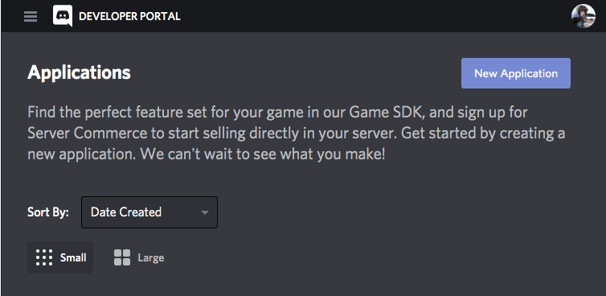
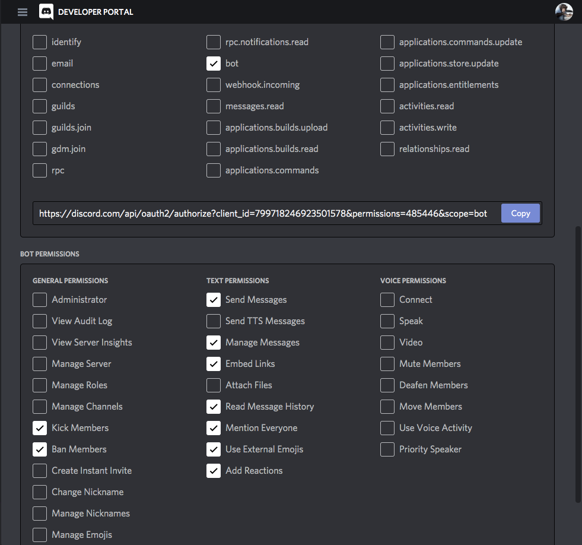
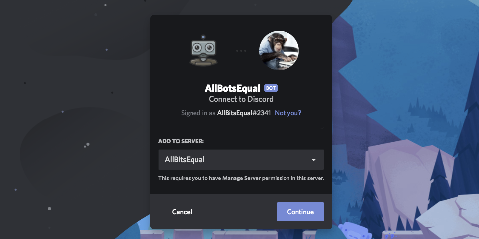
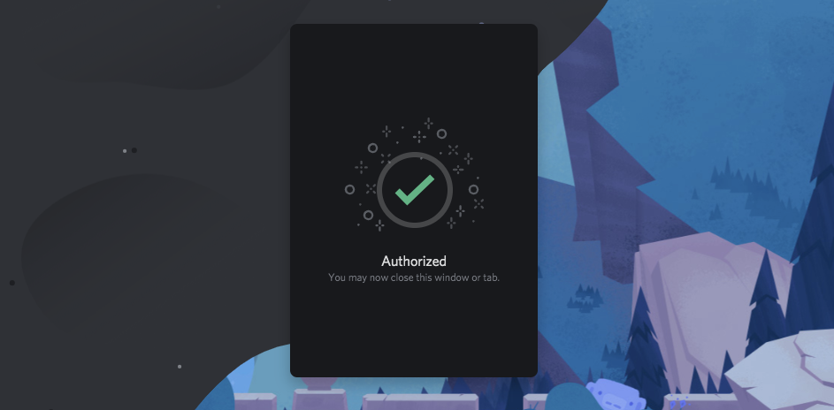
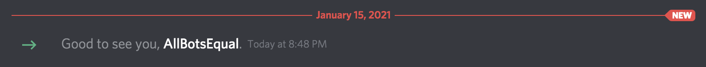
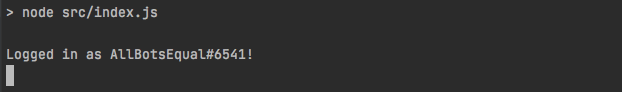
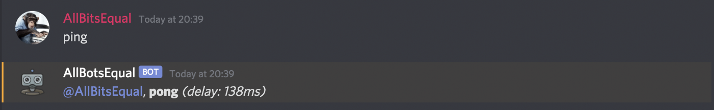
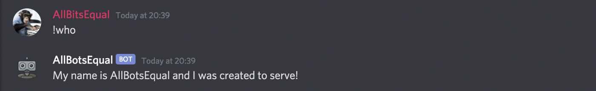

Discord Bots können in JavaScript oder Python geschrieben werden und deinen ersten Bot zu bauen und zum Laufen zu kriegen ist ein super Weg, um deine Vanilla JS Skills zu trainieren und ein bisschen Spaß zu haben. Wir werden hier den gesamten Prozess abdecken. Du erfährst, wie du den Bot mit Discord registrierst, welches Basis-Setup du benötigst und wie du den Bot auf deinen Server bringst.


## Voraussetzungen

Es gibt nicht viel, das du brauchst, um einen Bot für Discord mit JavaScript zu schreiben und während du rein theoretisch alles mit copy- und paste-Schnipseln, die von anderen Leuten geschrieben wurden, zusammensetzen könntest, empfehle ich ausdrücklich etwas Javascript-Vorwissen. Das hier brauchst du außerdem:

* Einen Discord Account & (desktop oder web) Client
* Einen Discord Server mit "manage server" Erlaubnis
* Basis-Wissen Terminal
* NodeJS Version 10 oder höher

## Erste Schritte - Discord Developer Portal

Um einen Bot zu schreiben und zu benutzen, musst du ihn als neue Applikation/Bot User mit deinem Discord Account registrieren. Geh zum [Discord Developers Portal](https://discordapp.com/developers/applications/) (Log-in) und erstelle eine "New Application".



Wähle einen Namen, der dir gefällt und fahre mit dem Erstellen der Applikation fort. Für meinen Server AllBitsEqual, werde ich das wunderbare Wortspiel "AllBotsEqual" verwenden... verurteilt mich nicht!


Auf der nächsten Seite kannst du eine kurze Beschreibung und ein Avatar-Bild hinzufügen und deine ID, Key und Secret sehen. Vergiss nicht, deine Änderungen zu speichern, sobald du fertig bist.


Gehe in der linken Leiste auf "Bot" und wähle dann "Add Bot" aus, um deiner neu erstellen Applikation einen Bot-User zuzuweisen.


Ok, das war auch schon der schwerste Teil... jetzt haben wir einen Bot mit Nutzer-ID, können uns den Token für später schnappen und die grundlegenden Berechtigungen definieren.


Um mit den Berechtigungen fortzufahren, geh in den OAuth2-Bereich, den du wieder in der linken Leiste findest.

Wähle in der ersten Box "bot" aus. Dadurch öffnet sich darunter eine zweite Box mit den Bot-Berechtigungen, in der du auswählen kannst, was der Bot machen soll und darf. Für dieses Tutorial musst du mindestens "Send Messages" und "Read Message History" erlauben, aber in späteren Artikeln werden wir noch mehr Funktionen, wie zum Beispiel eine Moderator-Funktion, hinzufügen.



Kopiere die URL, die mit unserer Bot-ID und den ausgewählten Berechtigungen generiert wurde. Deine Auswahl ist Teil der URL und wird als Nummer hinter dem Berechtigungs-Attribut codiert.

Wenn du diese URL im Web-Browser deine Wahl eingibst und mit deinem Discord-Account eingeloggt bist, kannst du den gewünschten Server auswählen, zu dem du den Bot hinzufügen möchtest (nur dort, wo du "manage server"- Berechtigungen hast) und in mit einem Klick auf "Authorise" autorisieren.



Dir wird die Liste deiner ausgewählten Berechtigungen angezeigt, die du bestätigen musst. Wenn du mit der Bestätigung fertig bist, solltest du diesen Bildschirm angezeigt bekommen.



Wenn du dir jetzt deinen ausgewählten Server anguckst, solltest du eine Nachricht sehen, in der steht, dass dein Bot soeben den Server betreten hat.



## Projekt Setup

Um dir den Einstieg zu erleichtern, habe ich ein [kleines Setup mit ein paar einfachen Kommandos und den Basics auf GitHub](https://github.com/AllBitsEqual/allbotsequal/releases/tag/v0.0.1) vorbereitet, mit dem deine Entwicklung mit den nützlichsten Standardwerkzeugen starten kannst. Du kannst dir den Code aus meinem Repository schnappen und ihn für dein eigenes Projekt in einen neuen Ordner legen.

Dieses Projekt beinhaltet zum einen DiscordJS, die Bibliothek, die wir für die meisten unserer Aktionen und Funktionalitäten in Discord verwenden und zum anderen ein einfaches linter/prettier-Setup, denn wer mag bitte keinen sauberen, formatierten und überprüften Code?

Weil du deinen supersicheren und privaten Token irgendwo aufbewahren musst, habe ich auch das dotenv Paket mit aufgenommen, das es dir ermöglicht, nicht verfolgte/unversionierte Umgebungsvariablen in deinem Projekt aufzubewahren. Nach dem Kopieren des obenstehenden Repositorys wird das das Erste sein, was du zu tun hast.

Um die inbegriffenen Pakete zu installieren, führe `npm install` im root-Verzeichnis deines neuen Projekts aus. Füge dann dem root Level deines Projektes eine .env-Datei hinzu (die auf der Ignorieren-Liste unserer .gitignore-Datei steht) and addiere die folgende Zeile indem du den Token benutzt, den du im Discord Developer Portal bekommen hast, um diese Bot-Sektion zu ersetzen "7074lly-n07-my-70k3n".

```bash
TOKEN=7074lly-n07-my-70k3n
```

## Der initiale Code, Eintauchen in DiscordJS

Ohne auch nur eine einzige Zeile Code zu verändern, könntest du jetzt den Bot starten, indem du entweder `node src/index.js` aufrufst, um die Datei auszuführen oder du führst das Skript aus der package.json-Datei `npm start` aus, was für das gleiche Ergebnis sorgt.

Jetzt wirst du den Bot online auf deinem Server sehen und deine Konsole sollte dir diese Zeile mit dem Namen des Bots und der ID-Nummer zeigen.



> *Eine kurze Randnotiz: Wenn du den Bot auf einem regulären Server mit anderen Benutzern konfigurieren und testen möchtest, wird empfohlen, einen Chat nur für Administratoren/Mods zu erstellen und den Bot direkt über Channel-Berechtigungen hinzuzufügen. Auf diese Weise wird dein Testen von Befehlen die normalen Nutzer nicht stören.*

Lass uns jetzt die Datei src/index.js aufschlüsseln, um dich durch die Grundlagen zu führen.

```javascript
require('dotenv').config()
const Discord = require('discord.js')
const config = require('../config.json')

const { TOKEN } = process.env
const { prefix, name } = config

const bot = new Discord.Client()
```

Wir benötigen unsere discord js- und dotenv-Pakete und importieren unsere config.json-Datei. Nachdem wir ein paar Werte durch Destrukturierung der Dateien .env und config.json erhalten haben, initialisieren wir ein neues Bot-Objekt.


```javascript
bot.login(TOKEN)

bot.once('ready', () => {
    console.info(`Logged in as ${bot.user.tag}!`) // eslint-disable-line no-console
})
```

Nachdem wir unseren Token der Login-Funktion unseres Bot-Objekts übergeben haben, fügen wir einen speziellen "once" Event-Listener für das bereitstehende Event hinzu, um uns zu benachrichtigen, wenn der Bot erfolgreich gelauncht und eingeloggt wurde. Unserem Linter gefällt die letzte Zeile nicht, aber er wird sie mit glückseliger Ignoranz ertragen müssen, dank unseres line-disable Kommentars.

Als Nächstes müssen wir dem Bot sagen, was er mit Nachrichten machen soll, die er in Kanälen „liest“, auf die er Zugriff hat. Dafür fügen wir einen weiteren Event-Listener für Events des Typen "message" hinzu.

> Im Moment verwenden wir mehrere if/else-Anweisungen. Das ist nicht der optimale Weg, aber für heute reicht das aus. In unserer nächsten Session werde ich das Konzept eines Befehlshandlers detaillierter erläutern.

```javascript
bot.on('message', message => {
    // ping command without a prefix (exact match)
    if (message.content === 'ping') {
        const delay = Date.now() - message.createdAt
        message.reply(`**pong** *(delay: ${delay}ms)*`)
        return
    }

    // ignore all other messages without our prefix
    if (!message.content.startsWith(prefix)) return

    // let the bot introduce itself (exact match)
    if (message.content === `${prefix}who`) {
        message.channel.send(`My name is ${name} and I was created to serve!`)
        return
    }

    // user info, either call with valid user name or default to info about message author
    if (message.content.startsWith(`${prefix}whois`)) {
        // if the message contains any mentions, pick the first as the target
        if (message.mentions.users.size) {
            const taggedUser = message.mentions.users.first()
            message.channel.send(
                `User Info: ${
                    taggedUser.username
                } (account created: ${taggedUser.createdAt.toUTCString()})`,
            )
        } else {
            // default to sender if no user is mentioned
            const { author } = message
            message.reply(
                `User Self Info: ${
                    author.username
                } (account created: ${author.createdAt.toUTCString()})`,
            )
        }
    }
})
```

Dies ist vielleicht etwas schwerer zu verdauen, aber ich habe versucht, ein paar wirklich grundlegende Szenarien hinzuzufügen, um dir ein umfassendes Verständnis davon zu geben, worauf wir Zugriff haben. Lass uns diese vier Szenarien noch einmal einzeln durchgehen.

### 1) ping

```javascript
if (message.content === 'ping') {
    const delay = Date.now() - message.createdAt
    message.reply(`**pong** *(delay: ${delay}ms)*`)
    return
}
```

Der erste Teil hört alle Nachrichten, die exakt "ping" lauten, nicht mehr und nicht weniger. Der Bot reagiert auf diese Nachrichten, indem er mit der Antwort-Funktion eine Antwort an den Autor der Nachricht sendet. Dazu berechnet er die vergangene Zeit zwischen dem Zeitstempel "message sent" (createdAt) und der aktuellen Zeit in Millisekunden und postet das Ergebnis in seiner Antwort als Pong.
Wenn wir hier `return` verwenden, überspringen wir den ganzen anderen Code, weil unsere Bedingung bereits erfüllt ist. Wir wollen ja keine Zeit verschwenden.



### 2) Überprüfe das prefix

```javascript
if (!message.content.startsWith(prefix)) return
```
Die nächste Zeile prüft einfach nur alle anderen Nachrichten auf das prefix, das wir in config.json definiert haben und das im Moment "!" ist. Alle Nachrichten, die unser prefix nicht haben (oder "ping" waren), können ignoriert werden.

### 3) !who am I

```javascript
if (message.content === `${prefix}who`) {
    message.channel.send(`My name is ${name} and I was created to serve!`)
    return
}
```
Wenn der Bot auf eine Nachricht trifft, die (genau) mit `!who` übereinstimmt, wird er mit einer kurzen Nachricht antworten, in der sein eigener Name (wieder aus der Konfiguration) und ein von uns geschriebener Flair-Text stehen.



### 4) !whois asking?

```javascript
if (message.content.startsWith(`${prefix}whois`)) {
    // if the message contains any mentions, pick the first as the target
    if (message.mentions.users.size) {
        const taggedUser = message.mentions.users.first()
        message.channel.send(
            `User Info: ${
                taggedUser.username
            } (account created: ${taggedUser.createdAt.toUTCString()})`,
        )
    } else {
        // default to sender if no user is mentioned
        const { author } = message
        message.reply(
            `User Self Info: ${
                author.username
            } (account created: ${author.createdAt.toUTCString()})`,
        )
    }
}
```

Der letzte Befehl, den ich eingefügt habe, ist etwas ausgefeilter. Wir suchen nach Nachrichten, die mit `!whois` anfangen und überprüfen den Rest der Nachricht auf eine User-Erwähnung (@username). Wenn ein Benutzer gefunden wird, antwortet der Bot mit einer kurzen Nachricht, die den Benutzernamen und das Datum der Benutzererstellung enthält. Wenn nach dem Befehl kein Text eingegeben wird oder kein Benutzer erwähnt wird, macht der Bot dasselbe für den Autor der Nachricht.


## Zusammenfassung

Ich glaube, wir haben heute ziemlich viel Stoff behandelt und du hast, zusätzlich zum Setup-Prozess über das Discord Developer Portal, ein paar grundlegende Befehle und Wege zur Interaktion mit Benutzernachrichten gelernt.

In den folgenden Sessions werden wir die if-/else-Anweisungen mit skalierbaren und flexibleren Befehlsmodul-Strukturen ersetzen, uns Setups angucken, die mehrere Bots von einem Projekt erlauben und uns mit Verwaltungsbefehlen beschäftigen, die Benutzer mit Warnungen, Kicks und anderen Methoden managen.

[Hier zum Original-Artikel auf English](https://allbitsequal.medium.com/build-a-bot-discordjs-javascript-chatbots-made-easy-bb31f6738a85){:rel="noopener noreferrer nofollow"}.
