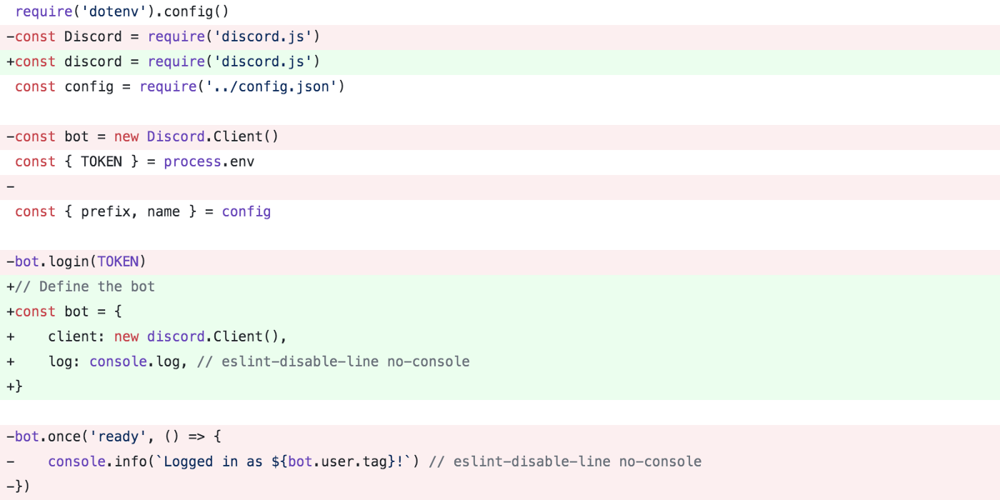

## Zuletzt bei „Baue einen Bot“

In unserer letzten Session haben wir einen funktionalen Discord-Bot mit einigen grundlegenden Befehlen und einer kleinen Konfiguration kreiert und alles mit unserer Discord-App/unserem Bot-Setup im Discord Developer Portal verlinkt, indem wir einen generierten Token verwendeten.

Heute werden wir unsere zentrale index.js-Datei aufräumen, sie lesbarer und skalierbarer machen und all unsere existierenden Befehle für den Import in einen separaten Ordner bewegen. Wenn das geschafft ist, werden wir auch die Funktionalität unseres Bots erweitern, indem wir einen komplexeren Befehl hinzufügen, um damit auf unserem Test-Server herumzuspielen und dir ein besseres Verständnis für die breite Palette an Funktionen, Tools und Befehlen zu geben, die mit Discord-Bots möglich sind.


Wenn du dir den Code aus der letzten Session schnappen oder ihn vergleichen möchtest: Hier ist der [GitHub link zum jeweiligen Tag](https://github.com/AllBitsEqual/allbotsequal/releases/tag/v0.0.1).

## Aufräumen

Als erstes werden wir unsere einfache Bot-Client-Instanz durch ein umfangreicheres Bot-Objekt ersetzen. Innerhalb dieses neuen Objekts werden wir unseren discord.Client() als Client spiegeln und da wir planen, unsere Protokollierung in der Zukunft zu erweitern, verstecken wir unsere vorläufige console.log hinter bot.log mit dem Kommentar, eslint für die no-console-Regel wie bisher zu deaktivieren. Auf diese Weise können wir dies für unsere Protokollierung verwenden und wenn wir später einen besseren Logger einführen, können wir es gleich dort tun.

```javascript
// File: src/index.js
require('dotenv').config()
const discord = require('discord.js')
const config = require('../config.json')

const { TOKEN } = process.env
const { prefix, name } = config

// Define the bot
const bot = {
    client: new discord.Client(),
    log: console.log, // eslint-disable-line no-console
}
```

Zum Vergleich habe ich die diff in unserer alten Datei mit inbegriffen. Am Ende eines jeden Schrittes findest du einen GitHub-Link zu den Commits/Changes, um sie mit deinem eigenen Code zu vergleichen.



Der nächste Punkt auf unserer Liste ist das Hinzufügen einiger Funktionen, die von den Event-Handlern ausgelöst werden und das Rückgrat unseres Bots bilden. Im Moment mag dies als "Overkill" oder verfrühte Optimierung erscheinen, aber wenn wir dies jetzt tun, wird der Code einfacher zu lesen UND einfacher zu erweitern und darauf aufzubauen sein.

Das ist im Grunde nichts Neues, es ist nur unsere load()-Funktion und unser "on ready" Event-Listener von letzter Woche, unter Verwendung unserer neuen Struktur.

```javascript
/*
 * Define all the core functions for the bot lifecycle
 */

// Load the bot
bot.load = function load() {
    this.log('Connecting...')
    this.client.login(TOKEN)
}

// Fired on successful login
bot.onConnect = async function onConnect() {
    this.log(`Logged in as: ${this.client.user.tag} (id: ${this.client.user.id})`)
}
```

Wir werden das Gleiche mit unserem "on message" Event-Listener-Code machen. Im Moment werden wir keine einzige Zeile Code in diesem Abschnitt ändern, aber wir werden ihn in eine Funktion verpacken, bevor wir ihn an die eigentlichen Event-Listener binden.


```javascript
// Check and react to messages
bot.onMessage = async function onMessage(message) {
    /*
     * THIS IS WHERE OUR OLD CODE REMAINS
     * => if ping
     * => if no prefix
     * => if who
     * => if whois with/without mention
     */
}

/*
 * Register event listeners
 */

bot.client.on('ready', bot.onConnect.bind(bot))
bot.client.on('error', err => {
    bot.log(`Client error: ${err.message}`)
})
bot.client.on('reconnecting', () => {
    bot.log('Reconnecting...')
})
bot.client.on('disconnect', evt => {
    bot.log(`Disconnected: ${evt.reason} (${evt.code})`)
})
bot.client.on('message', bot.onMessage.bind(bot))

// start the bot
bot.load()
```

Wie du siehst, verwenden wir einfache Log-Calls für alle Arten von Fehlerzuständen und Problemen, während wir unsere onConnect- und onMessage-Funktion an ihre jeweiligen Event-Handler binden.

Die letzte Zeile ist sehr wichtig, dann das ist die Zeile, die unseren Bot tatsächlich aufruft, sobald alles andere definiert und eingerichtet ist.

Für eine sauberere Trennung in unserer Datei haben wir jetzt die folgende Reihenfolge:

- Imports
- Setup
- Funktionen
- Event-Handlers
- Call zur Lade-Funktion

Das Ausführen von `npm start` auf der Befehls-Zeile wird unseren Bot wie beim letzten Mal booten. So weit, so gut.


[GitHub Commit](https://github.com/AllBitsEqual/allbotsequal/commit/2bfb4a8a7f7dbc148a2a48d1e414381332fa83d7)

## Extrahieren unserer Befehlslogik

Wie du siehst, ist unsere Indexdatei selbst mit der Grundkonfiguration schon fast 100 Zeilen lang und wir sollten versuchen, unsere Dateien sowohl so kurz wie möglich UND so konzentriert wie möglich zu halten. Mit jedem neuen Befehl, den wir dem Bot hinzufügen, würde diese Datei immer umfangreicher werden, also verschieben wir alle vorhandenen Befehle in einen neuen Ordner und importieren sie von dort.

Erstelle einen neuen Ordner namens "commands" unter src/  und füge neue, leere Dateien für unsere Befehle und eine zentrale index.js-Datei hinzu.

```
yourProject/
    src/
        commands/
            index.js
            ping.js
            who.js
            whois.js
        index.js
...
```

Der Ping ist, wieder einmal, der einfachste Fall. Erstelle einfach ein module.exports-Objekt mit Name, Beschreibung und der Ausführung unseres Befehls.

```javascript
// File: src/commands/ping.js
module.exports = {
    name: 'ping',
    description: 'Ping! Pong?',
    execute(message) {
        const delay = Date.now() - message.createdAt
        message.reply(`**pong** *(delay: ${delay}ms)*`)
    },
}
```

Wenn wir zu unserem "who"-Befehl übergehen, stoßen wir auf das erste Problem. Wir müssen die Konfiguration erneut importieren, um Zugriff auf die Namensvariable zu haben.

```javascript
// File: src/commands/who.js
const { name } = require('../../config.json')

module.exports = {
    name: 'who',
    description: 'Who is this helpful bot?!',
    execute(message) {
        message.channel.send(`My name is ${name} and I was created to serve!`)
    },
}
```

### Importieren zum Exportieren

Wiederhole den gleichen Vorgang für den "whois"-Befehl und öffne dann eine neue src/commands/index.js-Datei. Wir müssen all unsere Module importieren und sie in einem Objekt kombinieren, das wir in unserem Haupt-Bot-Code verwenden werden.

```javascript
// File: src/commands/index.js
const ping = require('./ping')
const who = require('./who')
const whois = require('./whois')

module.exports = {
    ping,
    who,
    whois,
}
```

Damit können wir nun alle Befehle in unsere Hauptdatei importieren und zu unserem Bot hinzufügen. Um das zu machen, werden wir eine neue Sammlung via `new discord.Collection()` erstellen.

```javascript
// File: src/index.js
require('dotenv').config()
const discord = require('discord.js')
const config = require('../config.json')
const botCommands = require('./commands') // <-- this is new

const { TOKEN } = process.env
const { prefix } = config

// Define the bot
const bot = {
    client: new discord.Client(),
    log: console.log, // eslint-disable-line no-console
    commands: new discord.Collection(),   // <-- this is new
}
```

In unserer bot.load-Funktion fügen wir einen neuen Schritt hinzu, bevor wir unseren Bot auf den Discord-Servern anmelden und für jeden Befehl ein neues Set in unserer Sammlung erstellen.

```javascript
// Load the bot
bot.load = function load() {
    this.log('Loading commands...')
    Object.keys(botCommands).forEach(key => {
        this.commands.set(botCommands[key].name, botCommands[key])
    })
    this.log('Connecting...')
    this.client.login(TOKEN)
}
```

Als Letztes in diesem Schritt müssen wir noch die alten Befehle in unserer onMessage-Funktion ersetzen und unsere schöne neue Sammlung hinzufügen. Dabei gibt es jetzt eine kleine Einschränkung (oder Änderung), aber die werde ich erklären, nachdem du einen Blick auf den Code geworfen hast.

```javascript
// Check and react to messages
bot.onMessage = async function onMessage(message) {
    // ignore all other messages without our prefix
    if (!message.content.startsWith(prefix)) return

    const args = message.content.split(/ +/)
    // get the first word (lowercase) and remove the prefix
    const command = args.shift().toLowerCase().slice(1)

    if (!this.commands.has(command)) return

    try {
        this.commands.get(command).execute(message, args)
    } catch (error) {
        this.log(error)
        message.reply('there was an error trying to execute that command!')
    }
}
```

Was soll dieser ganze Code, fragst du dich? Lass uns einen Blick drauf werfen. Zunächst einmal prüfen wir noch auf unser Präfix. Dann teilen wir die Nachricht in ein Array auf und speichern es als unsere Args. Das wird später nützlich sein, wenn wir Befehle wie `!tag add <tag name> <tag message>` bauen.

Dann shift() wir den ersten Teil aus diesem Array als unseren Befehl (indem wir unser args-Array mutieren) und entfernen ihn aus dem Präfix. Wenn wir den Befehl in unserer Befehlsliste nicht finden können, können wir direkt beenden. Andernfalls können wir versuchen, den Befehl aus der Sammlung auszuführen, und um hier auf Nummer sicher zu gehen, verpacken wir das in ein try/catch.

> Beim Schreiben dieses Teils des Tutorials stieß ich auf das Problem des fehlenden „name“ für den !who-Befehl und glücklicherweise hat mir der try/catch-Error direkt geholfen, das Problem zu identifizieren und den Bot am Laufen zu halten. Ich hätte sonst eine sehr wütende node-Fehlermeldung über eine unbehandelte Ausnahme gesehen.

### Was war der Vorbehalt?

Unser ping wird jetzt auch das Präfix benötigen. Es hätte mehrere mögliche Lösungen für das Problem gegeben, aber keine davon fühlte sich sauber an und weil ich diesen Bot noch nirgendwo eingesetzt habe, kann ich das jetzt noch ganz einfach ändern. `ping` ist jetzt `!ping`...

## Hinzufügen einer Standardkonfiguration

Bisher haben wir beim Hinzufügen der "ping"- und "who/whois"-Befehle nur den Parameter "message" verwendet. Wir haben nun das Array "args" hinzugefügt, aber um unsere Funktionen flexibler zu machen und eine bessere Integration mit Discord zu ermöglichen, fügen wir unser Bot-Objekt ebenfalls zum Command-Handler hinzu.

**Warum?** Weil wir Dinge wie unsere Standardfarben für das Benutzerfeedback (Erfolg, Error usw.), Variablen wie das Bot-"Name"-Feld, das wir vorher vermisst haben, und vieles mehr in einem Config-Attribut definieren können und auf diese Werte dort zugreifen, wo wir sie brauchen. Dies wird uns helfen, später Anpassungen vorzunehmen und redundanten Code und Einstellungen zu vermeiden, indem wir diese Werte an einem zentralen Ort aufbewahren.

Lasst uns also eine weitere Änderung an der src/index.js vornehmen, indem wir die Standardfarben zu den Bot-Einstellungen hinzufügen und unseren Call für die Befehlsausführung so anpassen, dass das Bot-Objekt ebenfalls übergeben wird.

```javascript
// File: src/index.js line 7 ff
const { prefix, name } = config // add the name again

// Config
const configSchema = {
    name,
    defaultColors: {
        success: '#41b95f',
        neutral: '#287db4',
        warning: '#ff7100',
        error: '#c63737',
    },
}

// Define the bot
const bot = {
    client: new discord.Client(),
    log: console.log, // eslint-disable-line no-console
    commands: new discord.Collection(),
    config: configSchema, // add the new config to our bot object
}
```

Wenn das getan ist, füge den Bot einfach zur Befehlshandler-Ausführung hinzu.

```javascript
// File: src/index.js line 57 ff
    try {
        this.commands.get(command).execute(message, args, bot) // added bot here
    } catch (error) {
        this.log(error)
        message.reply('there was an error trying to execute that command!')
    }
```

## Endlich, ein neuer Befehl - wirf die Würfel

Als lustige Übung fügen wir einen `!dice`-Befehl hinzu, der es dem User ermöglicht, eine Anzahl und Art von Würfeln auszusuchen, die dann vom Bot gewürfelt werden.

Ich habe zuvor eine Würfelfunktion namens `getDiceResult()` als Übung geschrieben. Ich habe sie eingefügt und angepasst, um die Ergebnisse und Texte zu generieren, die wir brauchen, um eine schöne und gut formatierte Nachricht in den Chat zu senden. Als Referenz findest du hier das Schema des Rückgabewerts der besagten Funktion.

```javascript
const {
  type,         // (string) "success" | "error"
  title,        // (string) title of the embedded message
  fieldName,    // (string) description of the result or error
  fieldContent, // (string) roll result or error message
  rest          // (array, optional) the rest of the message bits from args
} = getDiceResult(args)
```

Der wirklich interessante Teil in dem neuen Befehl ist die eingebettete Nachricht, die discordJS bereitstellt. The really interesting part in the new command is the embedded message provided by discordJS. Es gibt eine Menge Dinge, die du zur Einbettung hinzufügen kannst, und es gibt sogar mehrere Möglichkeiten, das gleiche Ergebnis bei der Definition der Felder zu erzielen ([lies die offiziellen Dokumente](https://discordjs.guide/popular-topics/embeds.html#using-the-richembedmessageembed-constructor)) aber für den Moment beschränken wir uns auf die Felder Titel, Farbe und Inhalt.

```javascript
// File: src/commands/dice.js
const discord = require('discord.js')

const getDiceResult = args => {...} // my dice function, hidden for readability

module.exports = {
    name: 'dice',
    description:
        `Roll a number of dice, either with no argument for 1 d6, ` +
        `one argument for a number of dice between 1 and 10 or with 2 arguments ` +
        `to define the dices' sides. (2, 3, 4, 6, 8, 10, 12, 20, 100)`,
    async execute(message, args, bot) {
        // run user input through dice function to get formatted results and feedback
        const { type, title, fieldName, fieldContent, rest } = getDiceResult(args)
        // create the embedded message
        const embed = new discord.MessageEmbed()
            .setTitle(title) // The title of the discord embedded message
            .setColor(bot.config.defaultColors[type]) // either "success" or "error"
            .addField(fieldName, fieldContent) // our dice results or error message
        // all additional/optional text the user entered after the params
        if (rest && rest.length) {
            embed.addField(`You added the following: `, rest.join(' '))
        }

        message.channel.send({ embed })
    },
}
```

Dieser Befehl erlaubt dem User, unterschiedliche Kombinationen des Befehls und der Argumente zu nutzen. Die folgenden 4 Muster sind valide:

- !dice
- !dice [1-10]
- !dice [1-10]d[2, 3, 4, 6, 8, 10, 12, 20, 100]
- !dice [1-10]d[2, 3, 4, 6, 8, 10, 12, 20, 100] "optional message"

Schauen wir uns die getDiceResult-Funktion im Detail an. Wir übergeben die Args und erhalten ein Objekt mit Strings, aber was passiert im Inneren?
Wenn du die untenstehenden Kommentare liest, wirst du sehen, dass wir versuchen, die Anzahl der "rolls" und die Art der "sides" des Befehls mit einigen Vorgaben zu erhalten, sie für unseren Regelsatz zu überprüfen und dann das Ergebnis zu berechnen.

Wenn der User ein ungültiges Argument eingibt, generieren wir eine Fehlermeldung und brechen die Ausführung ab.

```javascript
const getDiceResult = args => {
    // get the param or default to "1d6"
    const [diceParam = '1d6', ...rest] = args
    // split rolls and sides when applicable with fallback
    const [rolls = 1, sides = 6] = diceParam.split('d')

    // check if rolls and sides are integer
    const intRolls = Number.isNaN(parseInt(rolls, 10)) ? 1 : parseInt(rolls, 10)
    const intSides = Number.isNaN(parseInt(sides, 10)) ? 6 : parseInt(sides, 10)

    // check if rolls and sides are within predefined rules
    const safeRolls = intRolls >= 1 && intRolls <= 10 ? intRolls : 1
    const safeSides = [2, 3, 4, 6, 8, 10, 12, 20, 100].includes(intSides) ? intSides : 6

    // check if the calculated params match the original params of the user
    if (parseInt(rolls, 10) !== safeRolls || parseInt(sides, 10) !== safeSides)
        return {
            type: 'error',
            title: 'Invalid Parameter',
            fieldName:
                'Please specify either no parameter or add a dice count such as 1d6 or 3d12.',
            fieldContent: 'Please see "!help dice" for additional information.',
        }

    // roll the dice
    const results = []
    for (let i = 0; i < safeRolls; i++) results.push(Math.ceil(Math.random() * safeSides))

    // format the response
    return {
        type: 'success',
        title: 'Dice Roll Result',
        fieldName: `You rolled ${safeRolls}d${safeSides}`,
        fieldContent: `[ ${results.sort((a, b) => a - b).join(', ')} ]`,
        rest,
    }
}
```

Um zu überprüfen, ob unser Bot mit allen Fällen so umgeht wie wir es erwarten, sind hier ein paar Variationen und deren Ergebnisse.


### Verfolgen wir unsere Schritte zurück

Damit sind wir mit dem neuen Befehl fertig (ich weiß, wir haben den !help-Teil heute übersprungen), aber mit der neuen Konfiguration, die wir für den letzten Teil gemacht haben, können wir noch einmal zur `!who`-Befehlsdatei zurückkehren und EINE letzte Bearbeitung machen, mit der wir den zusätzlichen Import loswerden und stattdessen den Bot-Param aus dem Ausführungsaufruf verwenden.

```javascript
module.exports = {
    name: 'who',
    description: 'Who is this helpful bot?!',
    execute(message, args, bot) {
        message.channel.send(`My name is ${bot.config.name} and I was created to serve!`)
    },
}
```

## Zusammenfassung

Wir haben unsere zentrale Indexdatei aufgeräumt, eine klare Trennung von Codeabschnitten auf der Grundlage ihrer Intention geschaffen und eine Befehlssammlung eingeführt, um alle Benutzereingaben basierend auf einer Reihe von importierten Befehlen aus separaten Dateien zu verarbeiten. Außerdem haben wir eine neue Konfiguration hinzugefügt und unsere Benutzernachrichten so vorbereitet, dass wir sie leicht nach Schlüsselwörtern und Parametern durchsuchen können.

Nächstes Mal werde ich dich durch den Prozess des Schreibens eines skalierbaren und sich selbst aktualisierenden Hilfe-Befehls sowie des Hinzufügens unserer ersten Befehle für die Benutzerverwaltung/Administration führen, um den Bot etwas nützlicher zu machen.

[Hier zum Original-Artikel auf English](https://allbitsequal.medium.com/build-a-bot-discordjs-a-scalable-setup-with-command-modules-7fecdda27b40){:rel="noopener noreferrer nofollow"}.
