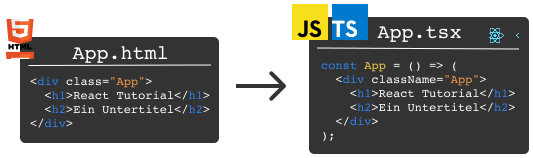

## Introduction

In this tutorial, we will use practical examples to understand the essence of the JavaScript library **React.js** in its latest version 19 and learn how to write modern web applications with **React**.

React 19 brings many exciting new features that make development even simpler and more performant. We will explore these new capabilities and show how they improve the way we develop React apps.

Combined with TypeScript and modern JavaScript syntax, the result is very elegant code.

This tutorial assumes no prior knowledge of React and is aimed at everyone who wants to learn and thoroughly understand it. However, you should have a basic understanding of HTML, CSS, and JavaScript.

We will build a web app that requests image information from a server and displays it — using the latest React 19 features like Actions, useOptimistic, and more.

This introduction is intended for beginners who are just getting started with React. The example is based on the first exercises from our workshop content in the [React Intensive Training](https://workshops.de/seminare-schulungen-kurse/react-modul-1).

Our teaching approach covers the motivation, the theory, and then the hands-on part. You can code all exercises yourself and get hints and sample solutions through our Workshops.DE Classroom.


## Table of Contents: What Will We Learn?

- [Introduction](#introduction)
- [Table of Contents: What Will We Learn?](#table-of-contents-what-will-we-learn)
- [What's New in React 19?](#whats-new-in-react-19)
  - [React Compiler](#react-compiler)
  - [Actions and Form Handling](#actions-and-form-handling)
  - [New Hooks](#new-hooks)
  - [Further Improvements](#further-improvements)
- [Why Not Build Without Libraries and Frameworks?](#why-not-build-without-libraries-and-frameworks)
- [Meta-Frameworks and React](#meta-frameworks-and-react)
- [What Is React and What Can It Do?](#what-is-react-and-what-can-it-do)
- [What Is React?](#what-is-react)
  - [React Does It Differently](#react-does-it-differently)
  - [React Is Fast — Thanks to the Virtual DOM](#react-is-fast--thanks-to-the-virtual-dom)
  - [React Isn't Just for the Web](#react-isnt-just-for-the-web)
- [Setting Up a Development Environment with Vite](#setting-up-a-development-environment-with-vite)
  - [Creating a Project](#creating-a-project)
  - [Understanding the Project Structure](#understanding-the-project-structure)
- [The Heart of React: Components](#the-heart-of-react-components)
  - [React Elements and JSX](#react-elements-and-jsx)
  - [React Components](#react-components)
- [Advantages of JSX](#advantages-of-jsx)
  - [JavaScript Expressions in JSX](#javascript-expressions-in-jsx)
  - [Conditional Rendering](#conditional-rendering)
- [React Props](#react-props)
  - [Props in React Components](#props-in-react-components)
  - [Props in React Elements](#props-in-react-elements)
  - [The Special `children` Prop](#the-special-children-prop)
- [Inline Styles in React](#inline-styles-in-react)
  - [Inline Styles](#inline-styles)
- [TypeScript: Making Components Safe](#typescript-making-components-safe)
  - [What Is TypeScript?](#what-is-typescript)
  - [Applying TypeScript](#applying-typescript)
- [Interaction with `onClick` Event Handlers](#interaction-with-onclick-event-handlers)
- [Organizing a React Project](#organizing-a-react-project)
- [API Requests with React 19 Actions](#api-requests-with-react-19-actions)
  - [The Traditional Way](#the-traditional-way)
  - [The Modern Way with Actions](#the-modern-way-with-actions)
  - [Optimistic Updates with useOptimistic](#optimistic-updates-with-useoptimistic)
- [React Hooks](#react-hooks)
  - [Reactivity](#reactivity)
  - [`useState` Hook](#usestate-hook)
    - [Replacing a Local Variable with State](#replacing-a-local-variable-with-state)
  - [Two Additional States](#two-additional-states)
    - [Loading Status](#loading-status)
    - [Catching and Displaying Errors with try-catch](#catching-and-displaying-errors-with-try-catch)
- [New React 19 Features in Practice](#new-react-19-features-in-practice)
  - [Server Components](#server-components)
  - [Document Metadata](#document-metadata)
  - [ref as a Prop](#ref-as-a-prop)
- [Conclusion](#conclusion)
  - [Comparison with Other Frontend Technologies](#comparison-with-other-frontend-technologies)
  - [Next Steps](#next-steps)
  - [Errors & Typos](#errors--typos)
  - [Acknowledgments](#acknowledgments)


[[cta:training-top]]

## What's New in React 19?

React 19 was released in December 2024 and brings revolutionary improvements. Let me briefly introduce the most important new features before we put them into practice in our tutorial.

### React Compiler

The new **React Compiler** is perhaps the biggest innovation. It automatically optimizes your code and makes manual performance optimizations unnecessary:

- **Automatic Memoization**: You no longer need `useMemo`, `useCallback`, or `memo`! The compiler automatically detects when components need to be re-rendered.
- **Better Performance**: The compiler transforms your React code into optimized JavaScript, resulting in faster apps.

### Actions and Form Handling

React 19 greatly simplifies working with forms and asynchronous operations:

```jsx
// New in React 19: Actions
async function updateName(formData) {
  const name = formData.get("name");
  await saveToDatabase(name);
}

<form action={updateName}>
  <input name="name" />
  <button type="submit">Save</button>
</form>
```

This is much simpler than the previous approach with event handlers and state management!

### New Hooks

React 19 introduces several new hooks:

- **`use()`**: Enables working directly with Promises and contexts
- **`useActionState()`**: Manages the state of asynchronous actions
- **`useOptimistic()`**: For optimistic UI updates
- **`useFormStatus()`**: Provides information about the status of a form

### Further Improvements

- **ref as a Prop**: `forwardRef` is no longer needed
- **Document Metadata**: Set title and meta tags directly in components
- **Server Components**: Better performance through server-side rendering
- **Improved Error Handling**: Clearer error messages for hydration issues

Throughout this tutorial, we will put many of these new features into practice!

## Why Not Build Without Libraries and Frameworks?

You can, of course, build a web application purely with HTML, CSS, and JavaScript.
However, without a JavaScript library like **React**, it is much harder to build web applications that truly run in every browser, look good, and are also performant.

JavaScript frameworks also bring built-in mechanisms for managing complex business logic or complex user interface (UI) updates. With **React**, you can add additional libraries for these more complex tasks step by step as needed.

Implementing complex operations without any libraries or frameworks leads to hard-to-maintain code and is much more error-prone, since custom solutions must be created for nearly every problem. Good solutions for problems that occur in every web app have emerged through the support of large developer communities that have gathered around various frameworks. This makes it much faster — even for beginners — to build robust and performant web apps.

## Meta-Frameworks and React

In addition to the core React library, there are various meta-frameworks that use React as a foundation and bring additional features:

- **Next.js**: The most popular React framework with server-side rendering, API routes, and more
- **Remix**: Focused on web standards and progressive enhancement
- **Gatsby**: Specialized in static websites with React
- **Astro**: A modern framework that can use React components in static websites

These frameworks build on React and extend it with features like routing, server-side rendering, and build optimizations. For our tutorial, however, we will focus on the fundamentals of React itself.


## What Is React and What Can It Do?

**React.js** (or simply **React**) is, in contrast to frontend **frameworks** that come bundled with everything, a lightweight **library**. Let me tell you a bit about what makes React special.

If you want to jump straight to the practical part of the tutorial, skip this chapter and go directly to [Setting Up a Development Environment with Vite](#setting-up-a-development-environment-with-vite).

## What Is React?

To build the user interface (UI) of a web application, you use the following three technologies:

- **HTML**: Defines the structure of the UI.
- **CSS**: Adds style (colors, spacing, etc.) to HTML elements.
- **JavaScript**: Responds to user interaction with HTML elements and triggers further processes.

### React Does It Differently

In other libraries, the interaction between JavaScript and HTML is accomplished through cross-references between HTML files and JavaScript files.

With React, you create logical units from a single mold — everything directly in a JavaScript file — without any HTML files (also known as templates).

When building the web app (i.e., during the build process), React code ultimately generates HTML elements too, since the browser expects them. As a React developer, however, you benefit from the gained simplicity. We'll see exactly what advantages this brings shortly.

### React Is Fast — Thanks to the Virtual DOM

So that React can display our components performantly in the browser, React uses a so-called **Reconciliation Algorithm** under the hood. It optimizes the rendering — the visual display of the web app in the browser — and thus the speed of the web app.

During rendering, our components are translated into the so-called **Domain Object Model** (**DOM**) — a tree-like structure of all HTML elements of the web app. Every change to the DOM causes the browser to recalculate some of the CSS styles and the layout of the HTML elements. And that then has to be converted into individual pixel values. (In addition to the DOM, there is also a CSSOM for styles, which React does not optimize. [Here](https://web.dev/articles/critical-rendering-path/render-tree-construction) you can read more about the full rendering cycle.)

All these calculations take time. Since every change to the DOM triggers these expensive calculations, you want to keep the number of DOM manipulations as low as possible.

**The idea behind React**: If only a specific section of the user interface needs to change compared to the currently visible UI, then only that corresponding part should be re-rendered.

**How does React do this?**: Using the Web API provided by browsers, React accesses the current DOM and creates a **virtual DOM** from it — a representation of the user interface stored in the browser's memory. When a change is about to happen, React compares the current state with the desired state in memory before the actual DOM is modified. This comparison is inexpensive in terms of performance. After the comparison, React only instructs the browser to re-render the areas of the DOM that are affected by the change.

> **Side note**:
>
> - [Svelte](https://svelte.dev/) is a newer technology that criticizes the use of a **virtual DOM**. Svelte is heavily inspired by React but takes a different, interesting approach. Learning React as a foundation for Svelte is, in my opinion, also a very good idea.

### React Isn't Just for the Web

Thanks to the **virtual DOM**, React is platform-independent.

On the web, the render engine called **React DOM** ensures that the virtual DOM renders to the **browser** DOM.

[React Native](https://reactnative.dev/) is a framework for developing native iOS and Android apps with React code. React Native renders the **virtual DOM** into native iOS and Android elements instead of HTML elements. React Native thus leverages the flexibility of the React library, which is not "married" to a specific platform but can theoretically run on any platform with different render engines beyond the browser.
In this spirit, React Native has the beautiful motto "Learn once, write anywhere." This expresses that by learning **React**, combined with **React Native**, you can develop user interfaces that can theoretically run on any platform.

Before we build our first component, let's briefly look at how to set up a modern React project with Vite.

## Setting Up a Development Environment with Vite

**Vite** is the modern build tool for React projects. It is blazingly fast and offers an excellent developer experience. Let's create a new React project together!

### Creating a Project

Open your terminal and run the following command:

```bash
npm create vite@latest my-react-app -- --template react-ts
```

This command creates a new React project with TypeScript support. Follow the instructions in the terminal:

```bash
cd my-react-app
npm install
npm run dev
```

Your app is now running at `http://localhost:5173`! 🎉

### Understanding the Project Structure

Vite creates a clear project structure:

```
my-react-app/
├── node_modules/       # Installed packages
├── public/            # Static files
├── src/               # Source code
│   ├── App.tsx        # Main component
│   ├── App.css        # Styles for App
│   ├── main.tsx       # Entry point
│   └── index.css      # Global styles
├── index.html         # HTML entry point
├── package.json       # Project configuration
├── tsconfig.json      # TypeScript configuration
└── vite.config.ts     # Vite configuration
```

The most important file is `index.html` in the root directory. It contains:

```html
<div id="root"></div>
<script type="module" src="/src/main.tsx"></script>
```

This is the entire HTML code of our React app! The `<script>` tag loads our React application.

In `src/main.tsx`, React is initialized:

```tsx
import React from 'react'
import ReactDOM from 'react-dom/client'
import App from './App.tsx'
import './index.css'

ReactDOM.createRoot(document.getElementById('root')!).render(
  <React.StrictMode>
    <App />
  </React.StrictMode>,
)
```

React 19 uses the new `createRoot` API, which enables better performance and concurrent features. The `App` component is rendered into the `root` element.

## The Heart of React: Components

Let's look inside the `App.tsx` file. We see a JavaScript function that seemingly returns HTML elements as its `return` value:

```tsx
export default function App() {
  return (
    <div className="App">
      <h1>Hello CodeSandbox</h1>
      <h2>Start editing to see some magic happen!</h2>
    </div>
  );
}
```

But appearances are deceiving. `<h1>` and `</h1>` are just as much JavaScript code as the visible `div` tags.

### React Elements and JSX

The `h1`, `div`, etc. are **React elements**. Each React element is a **JavaScript object** that describes a specific HTML element as it appears in the **DOM**. React extends JavaScript syntax with these XML-like tags called **JSX**. This allows you to write the following:

```jsx
const Title = <h1>Hello world.</h1>;
```

Under the hood, React translates the JSX syntax into optimized JavaScript code. Since React 17, React uses a new JSX transform that employs `_jsx` functions:

```jsx
const Title = _jsx("h1", { children: "Hello world." });
```

This modern transform is more efficient and allows you to use React without explicitly importing `React` — a feature that is standard in React 19.

### React Components

A function that returns a React element is a **React component**. Components are the reusable building blocks of a user interface in React. As mentioned above, in React the HTML skeleton can be written directly in JavaScript. For example:



These are exactly the HTML elements that React components are translated into by the React render engine **React DOM** for display in the web browser.

The `App` component consists of a composition of multiple React elements and can be used just like one, namely as `<App />` (here with a self-closing tag since the App component has no `child` — more on that shortly).

Remember? In `index.tsx`, the `App` component is used exactly like this:

```tsx
render(<App />, rootElement);
```

[[cta:training-bottom]]

## Advantages of JSX

Alright, JSX looks similar to HTML. But what's the benefit of writing my HTML (also called **markup**) in JavaScript?

### JavaScript Expressions in JSX

Logic using **JavaScript expressions** can be used directly in the description of the UI. To do this, expressions are wrapped in curly braces. Replace the existing `h2` element in the code with the following:

```tsx
<h2>Time now: {new Date().toISOString()}</h2>
```

### Conditional Rendering

As another example, **conditional rendering** can be implemented very elegantly. Certain elements should only be rendered under specific conditions.

Later, we want to request data from an API. Depending on the value of the boolean variable `isLoading`, we want to render different elements:

```tsx
<div>{isLoading ? <p>Loading...</p> : <h2>Done loading</h2>}</div>
```

Here we use the [ternary operator](https://developer.mozilla.org/en-US/docs/Web/JavaScript/Reference/Operators/Conditional_Operator). You'll see it often in React apps.

For now, we set `isLoading` to a fixed value. We'll change it dynamically later during the API call. This way, we can put everything into the `App` component. Change the value of `isLoading` to observe the differences in the UI:

```tsx
export default function App() {
  const isLoading = false;
  return (
    <div className="App">
      <h1>React Tutorial</h1>
      <h2>Time now: {new Date().toISOString()}</h2>
      <div>{isLoading ? <p>Loading...</p> : <h2>Done loading</h2>}</div>
    </div>
  );
}
```

We can extract this new UI logic into a React component called `LoadingText`:

```tsx
const LoadingText = () => {
  const isLoading = false;
  return <div>{isLoading ? <p>Loading...</p> : <h2>Done loading</h2>}</div>;
};
```

Copy this component into the `App.tsx` file somewhere above the `App` component.
Use the component as `<LoadingText />` in the `App` component. Try it quickly yourself.

The `App` component should now look like this:

```tsx
export default function App() {
  return (
    <div className="App">
      <h1>React Tutorial</h1>
      <h2>Time now: {new Date().toISOString()}</h2>
      <LoadingText />
    </div>
  );
}
```

Bravo! 🎉 Our first React component `LoadingText` is successfully in action! But it would be nice to pass the `isLoading` value to the `LoadingText` component instead of hardcoding it inside. To do this, we create an `isLoading` **prop**.

## React Props

JavaScript expressions can appear not only as content of React components but also in React **props**.

> **React properties** (or **props** for short) are comparable to HTML attributes. A **prop** is passed to a React element or a React component by placing it in the opening tag.

### Props in React Components

This is how we want to use the `LoadingText` component from now on. Go ahead and adjust this in the code:

```tsx
<LoadingText isLoading={true} />
```

We pass the current status — whether loading is in progress or not — as an `isLoading` **prop** to the `LoadingText` component.

A React component is a function that returns a JSX element. The first argument is always an object of the passed `props`, which we can access like this:

```tsx
const LoadingText = (props) => {
  return (
    <div>
      {props.isLoading ? <span>Loading...</span> : <h2>Done loading</h2>}
    </div>
  );
};
```

With `props.isLoading`, we access the `isLoading` **prop** and use it in our condition.

Using [object destructuring](https://developer.mozilla.org/en-US/docs/Web/JavaScript/Reference/Operators/Destructuring_assignment#object_destructuring), I can simplify access to the `isLoading` **prop**. Additionally, since there are no other expressions besides the `return`, I can omit the `return` keyword and get:

```tsx
const LoadingText = ({ isLoading }) => (
  <div>{isLoading ? <span>Loading...</span> : <h2>Done loading</h2>}</div>
);
```

### Props in React Elements

Just like with custom components, you also pass **props** to React elements (`div`, `h1`, `h2`, etc.).

`className` is, for example, a **prop**. In `App.tsx`, it is set here:

```tsx
<div className="App">
```

> `className` is a special **prop**. With it, we pass the style of the `.App` class (whose CSS code is in `styles.css`) to the `div` element.

Unlike HTML, the prop for referencing (linking) the style is called `className` rather than `class`, as the corresponding HTML attribute is named.


Using curly braces, a property can also be passed conditionally:

```tsx
<div className={severity === "warning" ? "warning" : "error"}>
  I am a warning or an error message.
</div>
```

To do this, write the following styles in the `styles.css` file:

```css
.warning {
  background-color: yellow;
}
.error {
  background-color: red;
}
```

How could this be written as a complete component? Try writing the function directly in the `App.tsx` file yourself before reading on.

**Solution**: Here is the `SeverityMessage` component:

```tsx
const SeverityMessage = () => {
  const severity = "warning";
  return (
    <div className={severity === "warning" ? "warning" : "error"}>
      I am a warning or an error message.
    </div>
  );
};
```

The `App` component should now look like this:

```tsx
export default function App() {
  return (
    <div className="App">
      <h1>React Tutorial</h1>
      <h2>Time now: {new Date().toISOString()}</h2>
      <LoadingText isLoading={false} />
      <SeverityMessage />
    </div>
  );
}
```

You can also refactor `SeverityMessage` just like the `LoadingText` component to accept **props**. Before reading on: Try refactoring the component yourself so that it receives two **props**: `severity` and `text`.

Does your result look similar to this (already including [object destructuring](https://developer.mozilla.org/en-US/docs/Web/JavaScript/Reference/Operators/Destructuring_assignment#object_destructuring))?

```tsx
const SeverityMessage = ({ severity, text }) => {
  return (
    <div className={severity === "warning" ? "warning" : "error"}>{text}</div>
  );
};
```

The component can now be used in the `App` component, for example, as follows:

```tsx
<SeverityMessage severity="error" text="Warning, error!" />
```

### The Special `children` Prop

Perhaps, like me, it bothers you about this solution that the text between the `div` tags is passed as a `text` prop instead of being placed directly between the tags, like this:

```tsx
<SeverityMessage severity="error">Warning, error!</SeverityMessage>
```

We can achieve this with the special `children` **prop**, which every React component automatically has. The content between the tags — here the string `"Warning, error!"` — is the so-called `child` of the React component and appears as the `children` **prop** in the `props` object:

```tsx
const SeverityMessage = ({ severity, children }) => (
  <div className={severity === "warning" ? "warning" : "error"}>{children}</div>
);
```

We essentially pass the text `"Warning, error!"` through and place it between the `div` tags.

Excellent! That was component number 2. 😎

## Inline Styles in React

Let's briefly talk about CSS styles in React.

In `App.tsx`, the CSS styles from the `styles.css` file are imported via `import "./styles.css";` and, as we've seen, set using `className` **props**.

> **Side note**: The bundler that transforms our code into HTML also ensures that the CSS styles imported here end up in the browser.

In addition, in React you can also set CSS styles **inline**.

### Inline Styles

**Inline styles** are styles that you write directly with the `style` **prop** in the HTML code rather than in a separate stylesheet (like `styles.css`). The `style` **prop**, like the `className` prop, is available on all React elements.

As in HTML, **inline styles** only affect the element they are applied to and override other styles. A common best practice when writing HTML code is to avoid inline styles entirely.

React breaks with this conventional wisdom by bringing inline styles back into the spotlight. So-called **"CSS-in-JS" libraries** that use inline styles are very popular in the React community.

> **Comment**: **"CSS-in-JS" libraries** bring the advantage that we can write CSS styles directly in JavaScript and thus have more options to connect styles with JavaScript functionality.

In the following graphic, you can see how, instead of a separate stylesheet, CSS can be used directly in JavaScript (JS) via a React `style` **prop**:


Unlike CSS properties, **CSS-in-JS** styles are not written in **kebab-case** (with hyphens) but in **camelCase** (with capital letters).

In general, in web app projects, styles are rarely written directly in the `style` **prop**, and [React also recommends not doing this too often](https://legacy.reactjs.org/docs/dom-elements.html#style). However, fewer and fewer separate CSS files are being written, and the use of **CSS-in-JS** libraries and **component libraries** is increasing. Alternatively, custom **design systems** are being built. CSS-in-JS libraries like [styled-components](https://styled-components.com/) or component libraries like [Chakra UI](https://chakra-ui.com/) internally use the `style` prop and make external CSS files (and the associated complexity of the CSS cascade) unnecessary.

React kicked off the idea of reusable components, and the evolution of the React ecosystem is pushing the direction of bundling HTML, JavaScript, and CSS all into a single JavaScript file.


## TypeScript: Making Components Safe

So far, we have written pure JavaScript code. The JavaScript programming language does not guarantee type safety at compile time.

While the app is running (i.e., at **runtime**), the types must be correct and all accessed fields must exist.

JavaScript cannot give you this assurance. As a programmer, you have to ensure yourself that, for example, the **prop** `severity` is actually passed and has the type `boolean`. Otherwise, `props.severity === "warning"` would lead to a runtime error.

### What Is TypeScript?

To avoid such and many other problems, we can make our JavaScript code "safer" with **TypeScript**. **TypeScript** takes care of such and many other safety checks for us.

> **Side notes**
>
> 1. If `severity` is defined here but is not of type `boolean`, JavaScript would forgive us and automatically convert the type to a `boolean` value. This is due to implicit conversions (known as [type coercions](https://developer.mozilla.org/en-US/docs/Glossary/Type_coercion)) that are part of the JavaScript language. However, this can lead to unintended conversions, which we cannot cover in detail here. This issue is also avoided by **TypeScript**.
> 2. By general definition, JavaScript is a type-safe language but not safe at compile time. I've also [written about this on StackOverflow](https://stackoverflow.com/a/55160101/3210677).

To do this, we use TypeScript code (which we write directly in our JavaScript code) to define exactly which props must be passed to each component (and which props are optional).

Since we want to use TypeScript in this tutorial, we have already given our files the `.tsx` (or `.ts`) extension instead of the `.js` extension.

However, since browsers can only work with JavaScript code, the TypeScript code in our `.tsx` and `.ts` files must first be compiled into JavaScript by the TypeScript compiler. Then the code can be handed over to the browser for execution.

### Applying TypeScript

**TypeScript** has the **interface** command. We can define such an **interface** for the `LoadingText` component:

```tsx
interface LoadingTextProps {
  isLoading: boolean;
}
```

The interface `LoadingTextProps` specifies that the only valid **prop** is `isLoading` as a **boolean** value. We use this interface in the `LoadingText` component as follows:

```tsx
interface LoadingTextProps {
  isLoading: boolean;
}

const LoadingText = ({ isLoading }: LoadingTextProps) => (
  <div>{isLoading ? <span>Loading...</span> : <h2>Done loading</h2>}</div>
);
```

In modern React (especially since v18/19), it is best practice to type props directly rather than using the `FC` (FunctionComponent) type. This makes the code simpler and avoids some issues that the `FC` type can cause.

> **Side note**: TypeScript is a programming language that makes it fairly easy to set initial types. However, to fully master TypeScript takes a lot of time and patience, as it is a very powerful language. Beyond the types we define here for React props, you can program very complex type constructions (e.g., custom generic types like `FC` from React). But that would clearly go beyond the scope of this React tutorial.

Traditionally, React components were also written as JavaScript classes — but we won't cover that in this tutorial, since modern React applications primarily consist of **function components**.

Now it's your turn! Create an interface for the **props** of the `SeverityMessage` component. Try it yourself before reading on.

**Solution**:

```tsx
interface SeverityMessageProps {
  severity: "error" | "warning";
}
```

We need to specify the `children` **prop** in the interface if we want to use it:

```tsx
interface SeverityMessageProps {
  severity: "error" | "warning";
  children: React.ReactNode;
}

const SeverityMessage = ({ severity, children }: SeverityMessageProps) => (
  <div className={severity === "warning" ? "warning" : "error"}>{children}</div>
);
```

After looking at `SeverityMessageProps`, do you see an opportunity to optimize the `SeverityMessage` component? Can we write the line `<div className={severity === "warning" ? "warning" : "error"}>` more concisely?

Try it yourself before looking at the following solution:

```tsx
const SeverityMessage: FC<SeverityMessageProps> = ({ severity, children }) => (
  <div className={severity}>{children}</div>
);
```

Yes, we can delete the entire ternary expression since the two classes are named exactly the same as the possible `severity` values.

> **Side note**: Besides checking types with TypeScript, you could also use [React PropTypes](https://legacy.reactjs.org/docs/typechecking-with-proptypes.html) (instead of TypeScript). However, due to the ever-growing adoption and the many additional benefits that TypeScript brings, PropTypes are used less and less, and we also skip them in this tutorial.

Let's now add interaction to the app.

## Interaction with `onClick` Event Handlers

Every **React element** has an `onClick` **prop** (a so-called `onClick` **event handler**) to which a JavaScript callback function can be passed. Add the following code to the rendered output of the `App` component:

```tsx
<button onClick={() => alert("You clicked.")}>Click here</button>
```

Clicking the button should open an alert window. The **callback function** (or simply "the callback") is passed as an anonymous function to the `onClick` **prop**. It essentially waits there until it is executed by **React** when the button is clicked.

Why does this work? In JavaScript, functions are "first-class citizens." This means functions can be passed as parameters to other functions. Here, we pass a callback function as a **prop** to a component that, under the hood, is a function (`React.createElement()`) as we saw at the beginning.

It is important to note that a function is always passed as a **prop** to the `onClick` event handler. A common mistake is to forget `() =>` and instead write `onClick={alert("You clicked.")}`, which causes the alert to be called on **every** render of the component.

The `App` component should now look roughly like this:

```tsx
export default function App() {
  return (
    <div className="App">
      <h1>React Tutorial</h1>
      <h2>Time now: {new Date().toISOString()}</h2>
      <LoadingText isLoading={false} />
      <SeverityMessage severity="error">Warning, error!</SeverityMessage>
      <button onClick={() => alert("You clicked.")}>Click here</button>
    </div>
  );
}
```

## Organizing a React Project

The `App.tsx` file has already become a bit cluttered. Typically, you write components in their own files and import them where they are used.

Let's do that now. Here's what it should look like in the end:


We create a new `components` folder and copy the `LoadingText` component into a new file `components/LoadingText.tsx`:

**LoadingText.tsx**:

```tsx
interface LoadingTextProps {
  isLoading: boolean;
}

const LoadingText = ({ isLoading }: LoadingTextProps) => (
  <div>{isLoading ? <span>Loading...</span> : <h2>Done loading</h2>}</div>
);

export default LoadingText;
```

The last line `export default LoadingText;` exports the component. In `App.tsx`, we import it with

```tsx
import LoadingText from "./components/LoadingText";
```

Please do the same with the `SeverityMessage` component before reading on.

This is what the `components/SeverityMessage.tsx` file should look like:

```tsx
interface SeverityMessageProps {
  severity: "error" | "warning";
  children: React.ReactNode;
}

const SeverityMessage = ({ severity, children }: SeverityMessageProps) => (
  <div className={severity}>{children}</div>
);

export default SeverityMessage;
```

And in `App.tsx`, you add the corresponding import:

```tsx
import SeverityMessage from "./components/SeverityMessage";
```

The `App.tsx` should now look much tidier. We are now ready to implement an API request.

## API Requests with React 19 Actions

Our button click should do more than just display an alert. We want to **load data** from a **server** and **display** it.

Specifically, we want to show an image with the photographer's name below it.


For this sample app, we use [Lorem Picsum](https://picsum.photos/), which provides an **API** with many sample images for testing.

### The Traditional Way

In the past, we would have used `useState` and `useEffect`. But React 19 offers us a much more elegant way with **Actions**!

### The Modern Way with Actions

Actions are a new way to handle asynchronous operations in React. They greatly simplify form handling and state management.

Let's create a modern component with React 19 features:

```tsx
import { useState, useTransition } from 'react';

// TypeScript type for image data
type ImageDataT = {
  id?: string;
  author?: string;
  width?: number;
  height?: number;
  url?: string;
  download_url?: string;
};

export default function App() {
  const [imageData, setImageData] = useState<ImageDataT>({});
  const [error, setError] = useState<string | null>(null);
  const [isPending, startTransition] = useTransition();

  // React 19 Action for loading data
  const loadImageAction = () => {
    startTransition(async () => {
      try {
        setError(null);
        const response = await fetch("https://picsum.photos/id/237/info");
        if (!response.ok) throw new Error('Error loading data');
        const data = await response.json();
        setImageData(data);
      } catch (err) {
        setError(err instanceof Error ? err.message : 'An error occurred');
      }
    });
  };

  return (
    <div className="App">
      <h1>React 19 Tutorial</h1>
      <h2>Time: {new Date().toISOString()}</h2>

      {error && <SeverityMessage severity="error">{error}</SeverityMessage>}

      {imageData.download_url && (
        <>
          
          <div>Photographer: {imageData.author}</div>
        </>
      )}

      <button onClick={loadImageAction} disabled={isPending}>
        {isPending ? 'Loading...' : 'Load image'}
      </button>
    </div>
  );
}
```

**What's new here?**

- **`useTransition`**: This hook marks updates as a "transition," allowing React to keep the UI responsive during loading.
- **Automatic Pending State**: `isPending` is automatically set to `true` while the action is running.
- **Better Error Handling**: Errors are cleanly managed in a state.

### Optimistic Updates with useOptimistic

React 19 also introduces `useOptimistic` to further improve the user experience:

```tsx
import { useOptimistic } from 'react';

function ImageGallery() {
  const [images, setImages] = useState([]);
  const [optimisticImages, addOptimisticImage] = useOptimistic(
    images,
    (state, newImage) => [...state, newImage]
  );

  async function uploadImage(formData) {
    const newImage = {
      id: Date.now(),
      url: URL.createObjectURL(formData.get('file')),
      author: 'You',
      pending: true
    };

    // Add optimistically - visible immediately!
    addOptimisticImage(newImage);

    // Actual upload
    try {
      const uploaded = await uploadToServer(formData);
      setImages(current => [...current, uploaded]);
    } catch (error) {
      // On error, the optimistic update is automatically rolled back
      console.error('Upload failed:', error);
    }
  }

  return (
    <form action={uploadImage}>
      <input type="file" name="file" />
      <button type="submit">Upload</button>

      <div className="gallery">
        {optimisticImages.map(img => (
          <div key={img.id} style={{ opacity: img.pending ? 0.5 : 1 }}>
            
            <p>{img.author}</p>
          </div>
        ))}
      </div>
    </form>
  );
}
```

With `useOptimistic`, you see the image immediately after clicking upload — even before it has actually been uploaded! This makes the app much more responsive.

## React Hooks

### Reactivity

Even though React is called **"React"**, a React app is not **"reactive"** out of the box. Only **hooks** and changing **props** make React reactive. What exactly does **reactive** mean?

An app is **reactive** when it automatically triggers changes in the user interface as soon as the displayed data changes.

As a developer, you don't have to manually program change scenarios for the user interface (as you would without a JS framework or with libraries like [jQuery](https://jquery.com/)). The app **reacts** automatically to changes. Developers simply describe the user interface and store the data according to the framework's rules. React then takes care of updating the UI — that is, re-rendering it — and only when necessary. The approach of describing a user interface rather than implementing all change commands is also called a **declarative** description of a user interface.

**React** has strongly influenced the entire frontend ecosystem through this **declarative** approach to describing a **reactive** user interface. This influence can be clearly seen, for example, in the frameworks **Vue**, **Flutter**, and **Svelte**.

### `useState` Hook

So that React can handle data reactively, the data must be stored in a local **React state** rather than in a local variable. We accomplish this with the `useState` hook, which we import in `App.tsx`:

```tsx
import { useState } from "react";
```

With the `useState` hook, we create our `imageData` React state. We write the following line as the first line in our `App` component:

```tsx
const [imageData, setImageData] = useState<ImageDataT>({});
```

The `useState` hook is a function that (optionally) receives an initial state and returns an array with two elements. The return value is composed as follows:

1. `imageData` is the changing state variable
2. `setImageData` is a function to write a new value into the state

Since an array is returned, you can name the two elements however you like. However, the convention of `foo` and `setFoo` for a state called `foo` is strictly followed.

> **Side notes**:
>
>  - We use [array destructuring](https://developer.mozilla.org/en-US/docs/Web/JavaScript/Reference/Operators/Destructuring_assignment) here to directly access the two elements in the array returned by the `useState` hook.
>  - Without array destructuring, we could achieve the same result like this:
>
>    ```tsx
>    const imageDataHook = useState<ImageDataT>({});
>    const imageData = imageDataHook[0];
>    const setImageData = imageDataHook[1];
>    ```

#### Replacing a Local Variable with State

We can now delete the local variable `imageData` and transform the `fetchImageData` function into the following:

```tsx
const fetchImageData = async () => {
  const response = await fetch("https://picsum.photos/id/237/info");
  const data = await response.json();
  setImageData(data);
};
```

Please reload the browser window and press the button again.

Tada! 🎉 The image appears! The change in the `imageData` state forced a re-render. The app is now **reactive**!

### Two Additional States

Last but not least, we create two more states. You can add as many states to a component as you like.

#### Loading Status

Right below the `imageData` state hook, we add the next hook:

```tsx
const [isLoading, setIsLoading] = useState(false);
```

The `LoadingText` component now receives this `isLoading` state:

```tsx
<LoadingText isLoading={isLoading} />
```

And in `fetchImageData`, we set the loading status `isLoading` to `true` before we begin fetching the data and back to `false` when we're done with the fetch.

```tsx
const fetchImageData = async () => {
  setIsLoading(true);
  const response = await fetch("https://picsum.photos/id/237/info");
  const data = await response.json();
  setImageData(data);
  setIsLoading(false);
};
```

#### Catching and Displaying Errors with try-catch

Server problems can prevent data from being fetched. Now we protect ourselves against such error cases.

Create an `isError` state for this. Please write the line to create the hook yourself and only then continue reading.

Here is the `isError` state hook:

```tsx
const [isError, setIsError] = useState(false);
```

To only display the `SeverityMessage` when there actually is an error, we now use the `SeverityMessage` component like this:

```tsx
{
  isError && (
    <SeverityMessage severity={"error"}>
      There was an error during the API call
    </SeverityMessage>
  )
}
```

> **Comments**:
>
> - In a **JSX** block, you can write JavaScript expressions using curly braces `{}`.
> - `&&`: Only if `isError` is not [falsy](https://developer.mozilla.org/en-US/docs/Glossary/Falsy) will `SeverityMessage` be rendered.
> - As you can see, we use `SeverityMessage` here differently than the `LoadingText` component. `SeverityMessage` does not receive the state variable `isError` directly as a **prop**.


We now wrap the API call with a **try-catch block** and also use the new hook within it:

```ts
const fetchImageData = async () => {
  setIsError(false);
  setIsLoading(true);

  try {
    const response = await fetch("https://picsum.photos/id/237/info");
    const data = await response.json();
    setImageData(data);
  } catch (error) {
    setIsError(true);
  } finally {
    setIsLoading(false);
  }
};
```

> - If the API call fails, the JavaScript runtime now jumps into the `catch` block, and you can show the user that something went wrong. We'll display the error as well.
> - In case of an error, we set the error status to `true`. As soon as a new data fetch is initiated, we reset the error status to `false`.
> - `setIsLoading` is in the `finally` block because we always want to reset the loading state regardless of the result.
>
> Test the error state by, for example, intentionally modifying the URL `https://picsum.photos/id/237/info` to be incorrect. If you click the button again now, you should be able to see the error message.

Excellent! We've built a small app that fetches data from an API and shows us loading and error states.

## New React 19 Features in Practice

Let's look at a few more new features of React 19 that simplify your development:

### Server Components

React 19 brings full support for Server Components. These are rendered on the server and significantly reduce the JavaScript bundle size:

```tsx
// This component runs only on the server
async function BlogPost({ id }) {
  // Direct database query — no API endpoint needed!
  const post = await db.posts.get(id);

  return (
    <article>
      <h1>{post.title}</h1>
      <p>{post.content}</p>
    </article>
  );
}
```

Server Components are particularly useful for:
- Static content
- Database queries
- Large dependencies that should not be sent to the client

### Document Metadata

In React 19, you can set metadata directly in components:

```tsx
function AboutPage() {
  return (
    <>
      <title>About Us - My App</title>
      <meta name="description" content="Learn more about our team" />

      <div>
        <h1>About Us</h1>
        <p>Welcome to our about page!</p>
      </div>
    </>
  );
}
```

No more need for `react-helmet` or similar libraries!

### ref as a Prop

A small but nice improvement: You can now pass `ref` directly as a prop:

```tsx
// Before (React 18)
const Input = forwardRef((props, ref) => {
  return <input ref={ref} {...props} />;
});

// Now (React 19)
function Input({ ref, ...props }) {
  return <input ref={ref} {...props} />;
}
```

This makes the code cleaner and more understandable!

### The New use() API

The `use()` hook is extremely versatile and can process Promises directly:

```tsx
import { use, Suspense } from 'react';

function UserProfile({ userPromise }) {
  // use() pauses the component until the Promise is resolved
  const user = use(userPromise);

  return <h1>Hello, {user.name}!</h1>;
}

function App() {
  const userPromise = fetchUser();

  return (
    <Suspense fallback={<div>Loading user data...</div>}>
      <UserProfile userPromise={userPromise} />
    </Suspense>
  );
}
```

### Form Actions in Practice

Here is a complete example with several new hooks:

```tsx
import { useActionState, useFormStatus } from 'react';

function SubmitButton() {
  const { pending } = useFormStatus();

  return (
    <button type="submit" disabled={pending}>
      {pending ? 'Saving...' : 'Save'}
    </button>
  );
}

function ContactForm() {
  const [state, formAction] = useActionState(
    async (prevState, formData) => {
      try {
        await sendEmail({
          name: formData.get('name'),
          email: formData.get('email'),
          message: formData.get('message')
        });
        return { success: true, error: null };
      } catch (error) {
        return { success: false, error: error.message };
      }
    },
    { success: false, error: null }
  );

  return (
    <form action={formAction}>
      {state.success && <div>Message sent!</div>}
      {state.error && <div>Error: {state.error}</div>}

      <input name="name" placeholder="Name" required />
      <input name="email" type="email" placeholder="Email" required />
      <textarea name="message" placeholder="Message" required />

      <SubmitButton />
    </form>
  );
}
```

These new features make React development not only simpler but also more performant and intuitive!

## Conclusion

Congratulations! You have just mastered the fundamentals of React 19 and learned many of the brand-new features along the way. With the React Compiler, Actions, optimistic updates, and the new hooks, you have powerful tools at your disposal to develop modern web applications.

You can download the complete code from this tutorial as a Vite project and run it locally. Experiment with the new features and continue expanding the app!

### What Makes React 19 So Special?

React 19 is a milestone in the framework's development:

- **Automatic Optimization**: The React Compiler makes manual performance optimizations unnecessary
- **Simpler Async Handling**: Actions and new hooks greatly simplify asynchronous operations
- **Better Developer Experience**: Less boilerplate code and more intuitive APIs
- **Server Components**: Dramatic performance improvements through server-side rendering

### Comparison with Other Frontend Technologies

React remains a flexible library even in version 19. Compared to:

- **Angular**: Offers more freedom in project structure, less "opinionated"
- **Vue.js**: Similarly flexible, but React has caught up with v19 in terms of performance and DX
- **Svelte**: React 19's compiler approaches Svelte's compile-time optimizations
- **Solid.js**: Shares many concepts, but React has a larger community

### Next Steps

To deepen your React 19 knowledge, I recommend:

1. **Master New Hooks**: Experiment with `use()`, `useOptimistic()`, and `useActionState()`
2. **Server Components**: Learn when and how to use them effectively
3. **Performance Optimization**: Understand how the React Compiler works
4. **Modern Patterns**: Use Actions for forms and asynchronous operations

Recommended resources:
- [Official React 19 Documentation](https://react.dev/)
- [React 19 Changelog](https://react.dev/blog/2024/12/05/react-19)
- [Vite Documentation](https://vitejs.dev/)

### Stay Up to Date!

React is constantly evolving. With React 19, you've learned the latest tools and best practices. Use them to build impressive applications!

Good luck and happy coding! 🚀

### Errors & Typos

I welcome comments and feedback via Twitter or other channels (links are available on my homepage) and/or corrections and improvement suggestions — also gladly via a pull request directly here.

### Acknowledgments

A big thank you goes to [Christian Ost](https://twitter.com/_christianost) for the thorough reading, critical review, and diligent correction of the tutorial!


If you'd like to see what the tutorial looks like live, check out how our trainer David works through the tutorial:
<iframe width="560" height="315" src="https://www.youtube.com/embed/Gk2BbJW0oQ0" title="YouTube video player" frameborder="0" allow="accelerometer; autoplay; clipboard-write; encrypted-media; gyroscope; picture-in-picture" allowfullscreen></iframe>

[[cta:training-bottom]]
